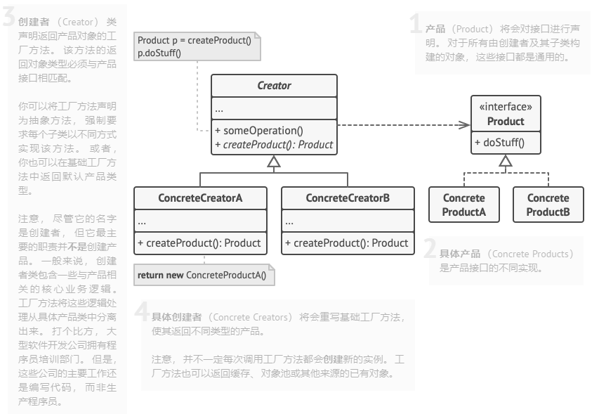

# 工厂方法模式

## 结构
- Product：具体产品需要实现的抽象接口。
- ConcreteProduct：具体的产品类，实现的是具体的业务。
- Creator：创建者基类，createProduct为创建产品对象的抽象接口（即工厂方法），someOperation接口则调用createProduct接口创建产品，再调用产品抽象接口来实现业务。
- ConcreteCreator：具体的创建者，每个具体创建者对应着一个具体的产品的创建，作为参数注入使用，从而实现不需要框架代码。


新增产品需要加的代码：
- 新增具体的产品类，实现产品需要的抽象接口Product。
- 新增具体的创建者，实现工厂方法，返回新增的具体产品对象。
- 修改业务代码逻辑，创建上面新增的具体创建者，作为参数注入到框架代码中，实现调用新增产品逻辑。

## 优缺点以及适用的场景

### 优点

### 缺点

### 适用场景

## 示例代码

```cpp
/**
 * The Product interface declares the operations that all concrete products must
 * implement.
 */

class Product {
 public:
  virtual ~Product() {}
  virtual std::string Operation() const = 0;
};

/**
 * Concrete Products provide various implementations of the Product interface.
 */
class ConcreteProduct1 : public Product {
 public:
  std::string Operation() const override {
    return "{Result of the ConcreteProduct1}";
  }
};
class ConcreteProduct2 : public Product {
 public:
  std::string Operation() const override {
    return "{Result of the ConcreteProduct2}";
  }
};

/**
 * The Creator class declares the factory method that is supposed to return an
 * object of a Product class. The Creator's subclasses usually provide the
 * implementation of this method.
 */

class Creator {
  /**
   * Note that the Creator may also provide some default implementation of the
   * factory method.
   */
 public:
  virtual ~Creator(){};
  virtual Product* FactoryMethod() const = 0;
  /**
   * Also note that, despite its name, the Creator's primary responsibility is
   * not creating products. Usually, it contains some core business logic that
   * relies on Product objects, returned by the factory method. Subclasses can
   * indirectly change that business logic by overriding the factory method and
   * returning a different type of product from it.
   */

  std::string SomeOperation() const {
    // Call the factory method to create a Product object.
    Product* product = this->FactoryMethod();
    // Now, use the product.
    std::string result = "Creator: The same creator's code has just worked with " + product->Operation();
    delete product;
    return result;
  }
};

/**
 * Concrete Creators override the factory method in order to change the
 * resulting product's type.
 */
class ConcreteCreator1 : public Creator {
  /**
   * Note that the signature of the method still uses the abstract product type,
   * even though the concrete product is actually returned from the method. This
   * way the Creator can stay independent of concrete product classes.
   */
 public:
  Product* FactoryMethod() const override {
    return new ConcreteProduct1();
  }
};

class ConcreteCreator2 : public Creator {
 public:
  Product* FactoryMethod() const override {
    return new ConcreteProduct2();
  }
};

/**
 * The client code works with an instance of a concrete creator, albeit through
 * its base interface. As long as the client keeps working with the creator via
 * the base interface, you can pass it any creator's subclass.
 */
void ClientCode(const Creator& creator) {
  // ...
  std::cout << "Client: I'm not aware of the creator's class, but it still works.\n"
            << creator.SomeOperation() << std::endl;
  // ...
}

/**
 * The Application picks a creator's type depending on the configuration or
 * environment.
 */

int main() {
  std::cout << "App: Launched with the ConcreteCreator1.\n";
  // std::string cfg = "ConcreteCreator1"; // read from config
  // Creator* creator = NULL;
  // if (cfg == "ConcreteCreator1") {
  //     creator = new ConcreteCreator1();
  // }
  Creator* creator = new ConcreteCreator1();
  ClientCode(*creator);
  std::cout << std::endl;
  std::cout << "App: Launched with the ConcreteCreator2.\n";
  Creator* creator2 = new ConcreteCreator2();
  ClientCode(*creator2);

  delete creator;
  delete creator2;
  return 0;
}
```
