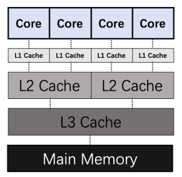
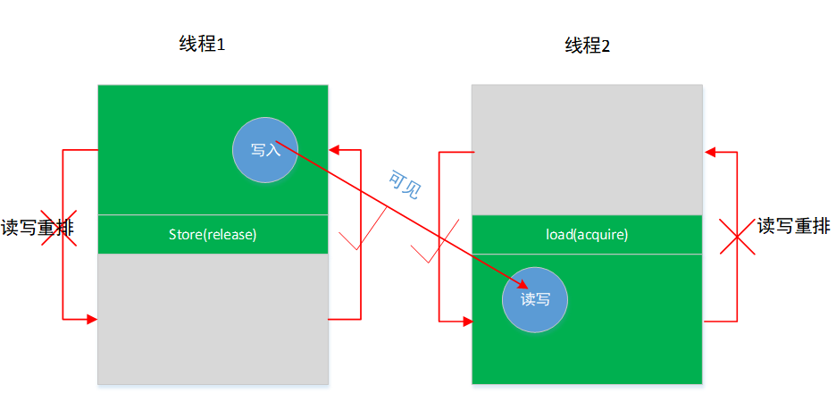
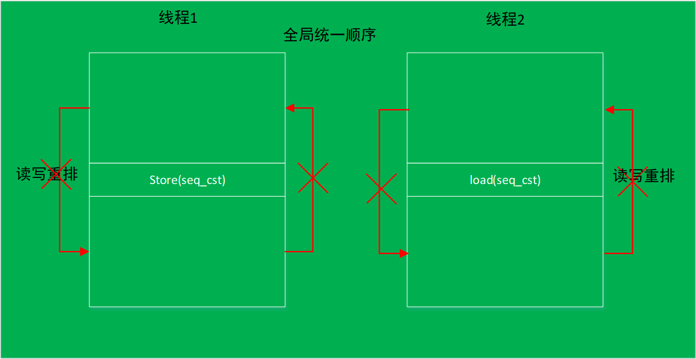

# 无锁队列

[返回主页](../../README.md)

## 指令重排
当程序为单线程时，对于变量的修改都是按序可见的，当读取一个变量的时候，肯定会对之前对该变量的修改可见，程序最终执行的结果，一定是和程序的代码顺序一致；但当程序为多线程的时候，由于编译器只知道当前线程中的读写依赖，并且可能会对指令进行重排乱序优化，同时由于多CPU核并行以及乱序执行，在多线程中，对于共享数据的执行顺序以及可见性是不确定的，因此需要手动对该部分共享数据做好控制。

比如在下面的代码中，存在两个线程并行，由于编译器的乱序优化，最终编译的可执行文件中，代码`loc_1`与`loc_2`执行顺序是不确定的，并非像代码中所示的`loc_1`执行在前`loc_2`执行在后，也可能是`loc_2`在前`loc_1`在后，因为两者并不存在数据依赖。因此`r1`与`r2`的值既可能是`0`也可能是`1`。

```cpp
x = 0, y = 0;

void thread_1() {
  x = 1; // loc_1
  r1 = y; // loc_2
  cout << r1 << endl;
}

void thread_2() {
  y = 1; // loc_3
  r2 = x; // loc_4
  cout << r2 << endl;
}

```

除此之外，即使执行顺序是代码中所示的顺序`loc_1`和`loc_3`在前，当执行到`loc_2`与`loc_4`时，`x`与`y`的值也并非全为`1`，因为当线程在各自不同CPU核上运行，当各自的修改存在于cache但未同步时，两线程中的修改其实是对别的CPU核是不可见的。在CPU中，存在多级缓存结构，每个CPU核在运行的时候，都会优先考虑自己的cache，当cache命中后，则不会从内存中取数据，并且不同CPU核的cache中的数据其实是不一致的。当其中某个CPU核对数据作出修改并保存在cache中，并且其修改未同步到内存中时，该修改操作其实是对其它核是不可见的，也就是说，当`thread_1`修改`x`的值后保存到cache中时，在另一个CPU核上的`thread_2`其实可能是看不见`x`已经被修改的，在`loc_4`处，`thread_2`其实可能看见的值还是`0`。



## 关系术语
对于上述的执行顺序以及不同线程间的可见性，下面介绍相关的三个术语，为sequenced-before、happens-before、synchronizes-with。

### sequenced-before
sequenced-before描述的是单线程中的关系，具有可传递性，对于两个操作A和B，如果A sequenced-before B，则A的执行应当在B的前面，并且A执行后的结果B也能看到，它引入了一个局部有序性。

### happens-before
happens-before关系是sequenced-before关系的扩展，额外包括了多线程中的关系。如果A happens-before B，则A的内存状态将在B操作执行之前就可见，这就为线程间的数据访问提供了保证。同样也具有可传递性。

### synchronizes-with
synchronizes-with相比于happens-before，则扩展出传播关系，即如果一个线程修改某变量的之后的结果能被其它线程可见，并且修改该变量前的全部相关操作也能被其它线程可见，那么就是满足synchronizes-with关系，相比于happens-before只关心单变量，synchronizes-with扩展出对该变量前后的范围操作的可见性。

## c++支持的内存模型
C++支持下述几种内存模型，对于relaxed的内存模型，则无任何限制，任由编译器优化与CPU乱序执行，下面将介绍acquire-release内存模型，以及seq_cst内存模型。
```cpp
enum memory_order {
    memory_order_relaxed,
    memory_order_consume,
    memory_order_acquire,
    memory_order_release,
    memory_order_acq_rel,
    memory_order_seq_cst
};
```

### Acquire-Release内存模型

- memory_order_acquire：用来修饰一个读操作，表示在本线程中，所有后续的关于此变量的内存操作都必须在本条原子操作完成后执行。
- memory_order_release：用来修饰一个写操作，表示在本线程中，所有之前的针对该变量的内存操作完成后才能执行本条原子操作。

Acquire-Release指的并不是release一定先于acquire执行，而是指的可见性，当acquire发现release处的内存改动后，一定也对release前的操作可见。
- load(acquire)所在的线程中load(acquire)之后的所有写操作（包含非依赖关系），不允许被移动到这个load()的前面，一定在load之后执行。
- store（release）之前的所有读写操作（包含非依赖关系），不允许被重排到这个store(release)的后面，一定在store之前执行。
- 如果store(release)在load（acquire）之前执行了（前提），那么store(release)之前的写操作对 load(acquire)之后的读写操作可见。




### seq_cst内存模型

seq_cst内存模型则相对更加严格，不仅要求前后代码不能重排，还互相有可见性。




## SPSC无锁队列

```cpp
//相对于顺序一致性 基于acquire release语义的同步 可提升8%左右的速度

template<class T, size_t capSize>
class spsc : private allocator<T> {
    public:
        spsc():_addr(allocator<T>::allocate(capSize)){}
        spsc(const spsc&) =delete;
        spsc(spsc &&) =delete;
        spsc &operator= (const spsc&) = delete;
        spsc &operator= (spsc&&) = delete;
        ~spsc(){
            allocator<T>::deallocate(_addr, capSize);
        }
        
        template<class ...Args>
        bool emplace(Args && ...args) {
            size_t h = head.load(memory_order_relaxed);
            if((h+1)%capSize == tail.load(memory_order_acquire)){ // loc_1，与loc_4同步，保证loc_4前的销毁在下面的代码中是可见的
//              cout<<head.load()<<" "<<tail.load()<<endl;
                return false;// full
            }
            allocator<T>::construct(_addr + h, forward<Args>(args)...);
            head.store((h+1)%capSize,memory_order_release); // loc_2，与loc_3同步，保证上面的构造在loc_3下面的代码中是可见的
//          cout<<"head add " << head.load();
            return true;
        }
        
        bool pop(T& tt){
            size_t t = tail.load(memory_order_relaxed);
            if(t == head.load(memory_order_acquire)){ // loc_3
                return false;//empty
            }
            tt = move(_addr[t]);
            allocator<T>::destroy(_addr+t);
            tail.store((t+1)%capSize,memory_order_release); // loc_4
            return true;
        }   
        
    private:
        T * _addr = nullptr;
        atomic<size_t> head{0};
        atomic<size_t> tail{0};
};

//#define _GNU_SOURCE
//#include <pthread.h>
//
//void pinThread(int cpu) {
//  if (cpu < 0) {
//    return;
//  }
//  cpu_set_t cpuset;
//  CPU_ZERO(&cpuset);
//  CPU_SET(cpu, &cpuset);
//  if (pthread_setaffinity_np(pthread_self(), sizeof(cpu_set_t), &cpuset) ==
//      -1) {
//    perror("pthread_setaffinity_no");
//    exit(1);
//  }
//}


int main(void){
    const size_t queueSize = 10000000;
    const int64_t iters = 10000000;
    
    spsc<int,queueSize> spc;
    thread in,out;
    int max_num = iters;
    auto start1 = chrono::steady_clock::now();
    in = thread([&](){
//      pinThread(0);
        for(int i=0;i<max_num;++i){
            while(!spc.emplace(i)){
//              cout<<"push fail"<<endl;
            };
        }
    });
    out = thread([&](){
//      pinThread(1);
        int tmp;
        for(int i=0;i<max_num;++i){
            while(!spc.pop(tmp));
//          cout<<tmp<<endl;
        }
    });
    in.join();
    out.join();
    auto end1 = chrono::steady_clock::now();
    cout << (long long )max_num * 1000000 / chrono::duration_cast<chrono::nanoseconds>(end1-start1).count() << "ops/ms";//14737ops/ms
    return 0;
}

/*
    spsc(acquire release同步)     :   14737ops/ms
    spsc 顺序一致性              :   13645ops/ms
*/
```

## 多线程下的无锁队列
基本实现思路为利用CAS原理，在C++中则利用`atomic`的`compare_exchange_strong`实现，细节待补充...

## 内核屏障
待补充...
```cpp
/* part 14: 内存屏障 */

#define lfence() __asm__ __volatile__("lfence": : :"memory")     // load defence      acquire    
#define sfence() __asm__ __volatile__("sfence": : :"memory")     // store defence     release    
#define mfence() __asm__ __volatile__("mfence": : :"memory")     // load + store defence

// 

```

## 内核无锁队列
待补充...

```cpp
/* part 13: 无锁消息队列 1生产者1消费者  */

struct kfifo { 
    unsigned char *buffer;    /* the buffer holding the data */ 
    unsigned int size;    /* the size of the allocated buffer */ 
    unsigned int in;    /* data is added at offset (in % size) */ 
    unsigned int out;    /* data is extracted from off. (out % size) */ 
    spinlock_t *lock;    /* protects concurrent modifications */ 
};

struct kfifo *kfifo_alloc(unsigned int size, gfp_t gfp_mask, spinlock_t *lock) 
{ 
    unsigned char *buffer; 
    struct kfifo *ret; 

    /* 
     * round up to the next power of 2, since our 'let the indices 
     * wrap' tachnique works only in this case. 
     */ 
    if (size & (size - 1)) { 
        BUG_ON(size > 0x80000000); 
        size = roundup_pow_of_two(size); 
    } 

    buffer = kmalloc(size, gfp_mask); 
    if (!buffer) 
        return ERR_PTR(-ENOMEM); 

    ret = kfifo_init(buffer, size, gfp_mask, lock); 

    if (IS_ERR(ret)) 
        kfree(buffer); 

    return ret; 
} 

unsigned int __kfifo_put(struct kfifo *fifo, 
             unsigned char *buffer, unsigned int len) 
{ 
    unsigned int l; 

    len = min(len, fifo->size - fifo->in + fifo->out); 

    /* 
     * Ensure that we sample the fifo->out index -before- we 
     * start putting bytes into the kfifo. 
     */ 

    smp_mb();

    /* first put the data starting from fifo->in to buffer end */ 
    l = min(len, fifo->size - (fifo->in & (fifo->size - 1))); 
    memcpy(fifo->buffer + (fifo->in & (fifo->size - 1)), buffer, l); 

    /* then put the rest (if any) at the beginning of the buffer */ 
    memcpy(fifo->buffer, buffer + l, len - l); 

    /* 
     * Ensure that we add the bytes to the kfifo -before- 
     * we update the fifo->in index. 
     */ 

    smp_wmb(); // store defence, make above code visiable in other thread, 保证上面的修改先同步，然后再同步修改fifo->in的值, 保证另外的线程如果能看见in的修改，那么必定能看见上面对对应内存区域的修改

    fifo->in += len; 

    return len; 
}

unsigned int __kfifo_get(struct kfifo *fifo, 
             unsigned char *buffer, unsigned int len) 
{ 
    unsigned int l; 

    len = min(len, fifo->in - fifo->out); 

    /* 
     * Ensure that we sample the fifo->in index -before- we 
     * start removing bytes from the kfifo. 
     */ 

    smp_rmb(); // read load acquire

    /* first get the data from fifo->out until the end of the buffer */ 
    l = min(len, fifo->size - (fifo->out & (fifo->size - 1))); 
    memcpy(buffer, fifo->buffer + (fifo->out & (fifo->size - 1)), l); 

    /* then get the rest (if any) from the beginning of the buffer */ 
    memcpy(buffer + l, fifo->buffer, len - l); 

    /* 
     * Ensure that we remove the bytes from the kfifo -before- 
     * we update the fifo->out index. 
     */ 

    smp_mb(); // read(load) write(store) barrier

    fifo->out += len; 

    return len; 
}
```


