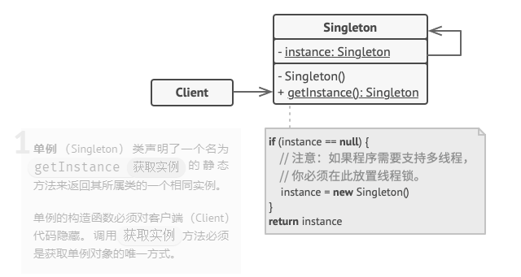

# 单例模式

## 结构
- 构造函数、拷贝构造函数、移动构造函数、移动赋值函数、拷贝赋值函数私有；
- 内部保存自身的指针，并且私有；
- 分为懒汉模式与饿汉模式，懒汉为第一次使用时才创建自身实例，饿汉则为程序运行时立马创建自身实例；
- 暴露接口，获取全局唯一的自身的实例指针。



## 优缺点

### 优点
- 能保证全局存在唯一实例。

### 缺点
- 多线程问题比较麻烦。


## 示例代码

### 懒汉模式

- 双检测法：atomic保证无memory-order问题。
```cpp
class App {
    static std::atomic<App*> instance;
    static std::mutex mu;
public:
    static App *get_instance() {
        auto *p = instance.load(std::memory_order_acquire); // (1)
        if (!p) {
            std::lock_guard<std::mutex> guard(mu);
            if (!(p = instance.load(std::memory_order_relaxed))) { // (2) mutex已保证(3)对(2)的可见性
                p = new App;
                instance.store(p, std::memory_order_release); // (3) 保证上面的new是对(2)可见的
            }
        }
        return p;
    }
};
```

- 局部静态变量：C++11要求编译器保证局部静态变量的线程安全性。
```cpp
class Singleton
{
private:
	Singleton() { };
	~Singleton() { };
	Singleton(const Singleton&);
	Singleton& operator=(const Singleton&);
public:
	static Singleton& getInstance() 
        {
		static Singleton instance;
		return instance;
	}
};
```

### 饿汉模式
```cpp
class Singleton
{
private:
	static Singleton instance;
private:
	Singleton();
	~Singleton();
	Singleton(const Singleton&);
	Singleton& operator=(const Singleton&);
public:
	static Singleton& getInstance() {
		return instance;
	}
}

// initialize defaultly
Singleton Singleton::instance;
```
