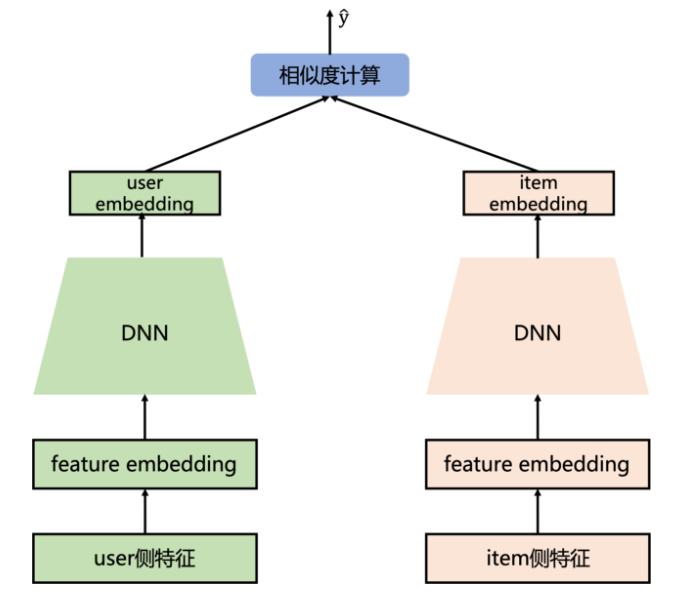
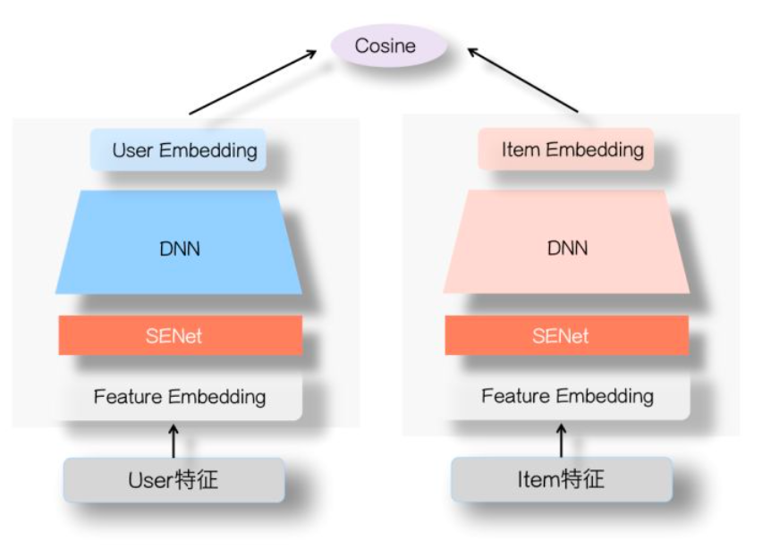

# 双塔模型

## 原理
> 目标：将用户与对应感兴趣的item(商品、视频、文章等)匹配起来；
> 方法：将用户的行为(如浏览、点击、评论等数据)或者画像数据(年龄、城市、职业、兴趣爱好、签名等信息)作为用户侧输入，将item的信息(比如item的名称、类别、创建时间、浏览量等)作为item侧的输入信息，分别作为双塔的两个输入，对应输出用户侧与item侧的embedding，然后将两者计算相似度，从而获取用户与对应的item的关联程度，对于关联程度较深的作为推荐内容；
> 实际方法：将用户行为向量化，然后拼接作为tower的输入，最后输出统一大小的embedding用于计算相似度；embedding需要归一化，实际数据构建会基于用户实际行为数据，利用前几天的数据作为输入，用后一天的点击数据或者浏览数据作为推荐结果，从而构建训练数据集；
> 负采样：从用户数据采集到的训练数据偏向热门，无法表达全部item的特征空间，为此需要对未曝光的item进行采样加入训练集，此外还有热门打压；还可以基于上一版本的推荐模型筛选出不相关的item作为hard negative；

## 经典双塔模型
> 结构如下，对于用户侧与item侧，分别有两个tower，分别计算embedding，最后计算embedding的相似度。

## SENet双塔模型
> 相比于经典双塔，加入了senet结构，相当于在原始特征上增加了一个权重系数，通过低权重过滤掉无效低频特征与噪声，通过高权重提高重要特征影响；

## 多目标双塔模型
> 相比于上述双塔单一任务，实际可能存在多个任务，比如给出最可能点赞的item、最可能评论的item、最可能转发的item等任务，做法就是增加塔的个数，同时获得多个相似度，在训练过程中一同优化这些损失，当然也能在这些损失中加入权重，使其更偏向于某些任务。

