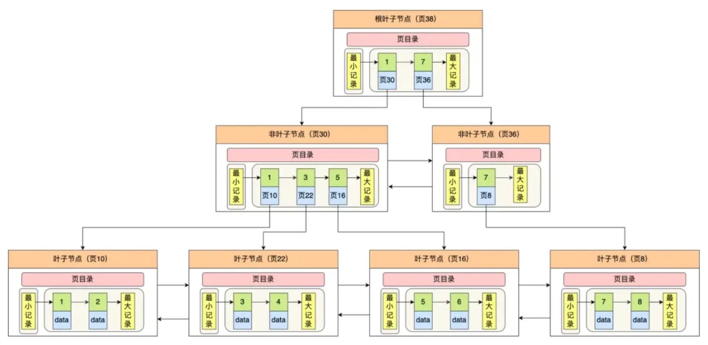
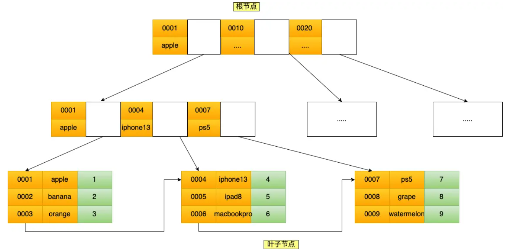

# MYSQL

## 设计之三大范式 
> 第一范式：要求数据库表的每一列都是不可分割的原子数据项。不能列中混杂多种信息，能够将此列分割就不满足第一范式。  
> 第二范式：在1NF基础上，第二范式需要确保数据库表中的每一列都和主键相关，而不能只与主键的某一部分相关（主要针对联合主键而言）。  
> 第三范式：第三范式需要确保数据表中的每一列数据都和主键直接相关，而不能间接相关，不能依赖于其它非主键属性。  

## innodb B+树结构
> B+树为多叉树，每个节点位于同一个数据页内，其中非叶子节点存储的是有序的键以及对应的子节点所在的页面位置，叶子节点存储了实际的行数据，对于同一层的节点，会采用双向链表进行链接，方便进行范围查询；
> 由于上述原因，在插入时，主键最好是有序递增的，这样就能顺序插入，顺序读写速度非常快，假如主键无序，可能插入位置位于B+树中间，导致节点分裂，从而导致速度慢以及空间浪费；
> 叶子节点位于同一层，因此平均查询时间处于同一量级，当查询时按索引查到最终叶子节点后，会在叶子节点内按二分进行搜索，数据页内有槽，每个槽包括了一批数据，利用槽进行二分搜索加速查询；

## 索引

### 聚簇索引与非聚簇索引
> 聚簇索引（主键索引）中，主键索引树种叶子节点存储的行记录，二级索引（其它索引）则存储的为主键值，需要回表；非聚簇则均为数据行指针；

### 主键索引、唯一索引、普通索引、前缀索引
> 主键索引：PRIMARY KEY (primary_key)，在创建表时声明primary_key列为主键，自动建立主键索引（聚簇）；  
> 唯一索引：UNIQUE KEY(unique_column,...)，unique_column为唯一索引，可为空，不重复；
> 普通索引：INDEX(index_column_1,index_column_2,...)，二级索引，多个则为联合索引；
>  前缀索引：INDEX(char_column(length))，按前length长度的前缀在B+树中进行排序，一般为char、varchar等类型设置前缀索引，提高效率，降低存储；

### 联合索引（普通索引）
> 对于普通索引，会单独构建B+索引树，其中的键可能是多个（当为联合索引时），此时按联合索引声明的顺序，按序进行排序，先按key1排，key1相等后再按key2排；  
> 因此，对于联合索引，会存在最左匹配原则，当最左匹配完后，索引就失效了；因此在创建联合索引时，需要将值类型多并且分布均匀的列排在联合索引最前（区分度高，便于最左匹配下过滤）；  

### 索引失效
- 使用左或者左右模糊匹配like%xx或者like%xx%；  
- 在查询条件中对索引列使用函数；  
- 在查询条件中对索引列进行表达式计算；  
- 字符串和数字比较的时候，会把字符串转为数字，索引列是字符串，条件语句中的输入参数是数字，相当于对索引列使用了cast函数；
- 联合索引不遵循最左匹配原则；
- WHERE子句中存在OR，并且其中某个条件列不是索引列；

### 覆盖索引与回表
> 当基于联合索引查询数据，需要查询的字段为联合索引中的字段时，不需要回表，索引覆盖；否则需要根据查到的主键值进行回表；
> 优化点：尽可能用覆盖索引，而不要回表；  

### 索引建立原则
> 区分度高；查询条件中使用量大；尽可能存在唯一性；经常用于GROUP BY、ORDER BY、DISTINCT、UNION的列；  
> 经常更新的字段不要设置索引；

### 索引优化
> 前缀索引优化；覆盖索引优化；防止索引失效；主键尽可能有序；

### 事务
1. ACID，脏读、不可重复读、幻读
2. 读未提交、读提交、可重复读、串行化

#### 并发问题
1. 行锁、表锁、页锁、间隙锁；MVCC；  
2. MVCC实现隔离级别：读提交隔离级别是在每个语句执行前都会重新生成一个Read View，而可重复读隔离级别是启动事务时生成一个Read View，然后整个事务期间都在用这个 Read View。

[返回主页](../../README.md)
