# unix网络编程

[返回主页](../../README.md)

### 第二章

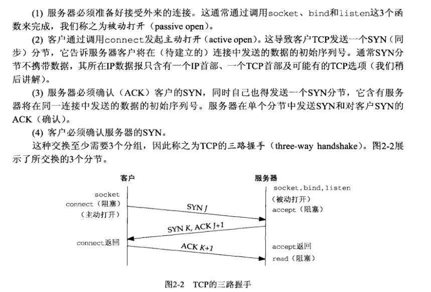

SYN参数：

TCPMAXSEG，控制MSS的，描述TCP分节大小。

SO_ECVBUF，窗口大小。

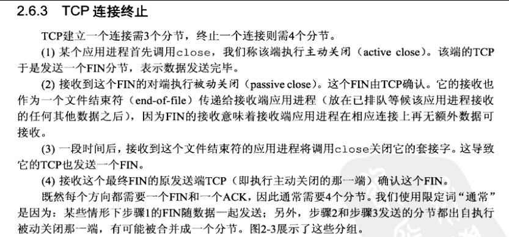

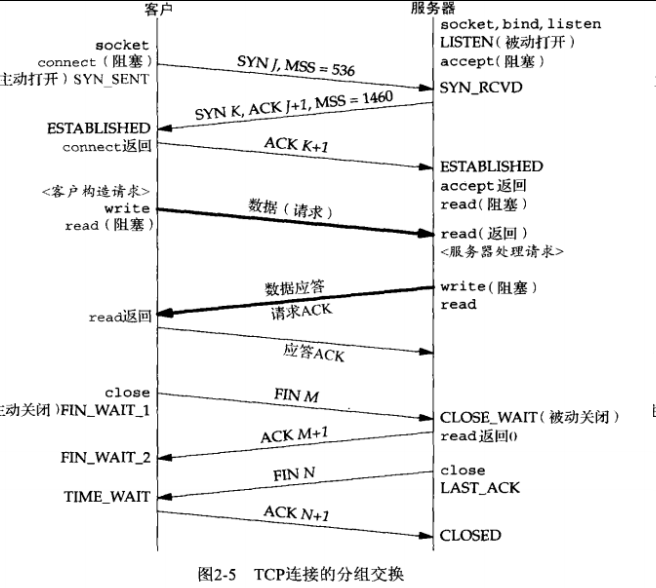

TIME_WAIT的2MSL(MSL=30s到2min)，分组在网络中的最大存活时间，原因是分组存在跳限（255）。

1. 可靠地保证全双工连接的终止；保证ACK顺利传输到对端；
2. 保证老的重复分组在网络中消逝；防止重复分组影响到后面相同的连接；

#### 2.6 TCP状态转换图
图存在部分错误，注意辨别

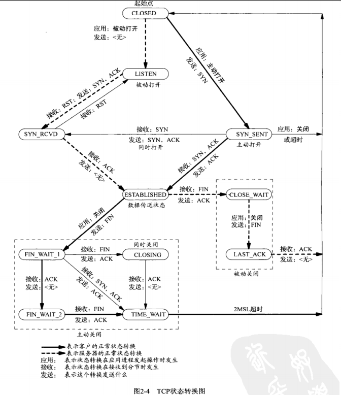

#### 2.11 缓冲区大小
IPV4数据报大小：包括IPV4头，65535字节，因为长度单位为16位；

IPV6数据报大小：包括头，65575字节，因为长度为16位，但长度表示的是净荷长度；

链路MTU大小：以太网为1500字节。

当IP数据报从接口发送出去时，若超过MTU大小，则IPv4与v6都执行分片，IPV4与V6主机都对自己产生的数据报进行分片，IPV4路由器会对转发的数据报进行分片，IPV6路由器则不会。

IP层默认需要支持的最小重组缓冲区大小：IPV4为576字节，IPV6为1500字节，可以理解为默认支持的MTU大小，对应基于IPV4的TCP发送的分节默认大小为576-20-20=536字节大小。

网络层支持的MSS：max segment size，2字节表示，告诉对端实际的重组缓冲区大小，从而避免传输层上的分片操作。一般为MTU-TCP首部大小-IP首部大小。在以太网中，用IPV4的MSS为1460字节，用IPV6的MSS为1440字节，其中MTU为1500字节，TCP首部20字节，IPV4首部20字节，IPV6首部40字节。

一般就是数据链路层的MTU，表示支持传输的最大消息长度，若超过了则ICMP消息报错或者分片，IP传输层的MSS，表示数据报的大小，传输层会根据MSS进行主动分片。

SO_SNDBUF套接字选项：更改TCP内核发送缓冲区大小。影响，若基于阻塞式的套接字，内核缓冲区写满会导致进程挂起休眠，write无法及时返回。当写入到套接字缓冲区，write即返回。

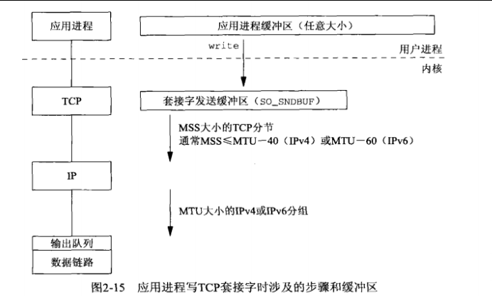

SO_LINGER套接字选项：

UDP也存在发送缓冲区大小，但实际并不存在套接字发送缓冲区，而是直接复制到内核，发送即丢弃。当写入数据大于缓冲区大小，返回EMSGSIZE错误给用户进程。UDP不会给数据进行分片，当发送数据超过MTU，IP层会给消息进行分片。当write返回，表示数据已经放入数据链路层的输出队列，当队列空间不足，返回ENOBUFS给用户进程。

### 第三章
#### 3.2 基本套接字
sockaddr_in s;

s.sin_family、s.sin_port、s.sin_addr.s_addr

进程传递套接字地址到内核：bind、connect、sendto、sendmsg    （sockargs函数）

内核传递套接字地址到进程：accept、recvfrom、recvmsg、getpeername、getsockname

通用套接字地址：sockaddr，bind函数的参数

字节序转换函数：

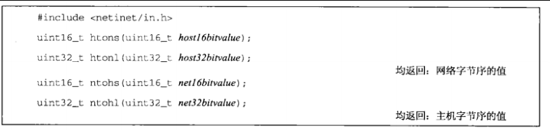

字节处理函数：

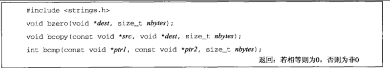
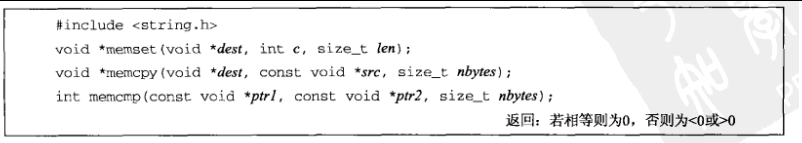

地址转换函数：

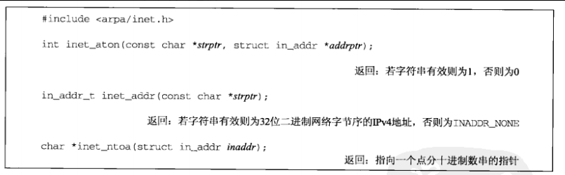
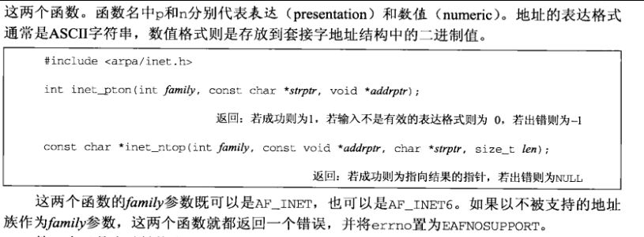

family不支持返回EAINOSUPPORT，len太小不足容纳结果，返回ENOSPC错误。

EINTR错误：系统调用被捕获的信号给中断。

recv+MSG_WAITALL 阻塞一次性读取指定字节数

### 第四章 基本TCP套接字编程
#### 4.2 socket函数
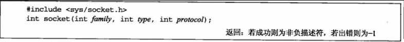
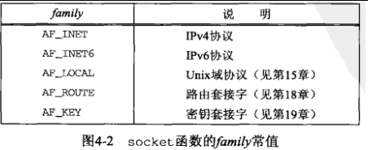

![]4.2.3.png)

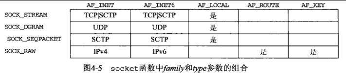

#### 4.3 connect函数
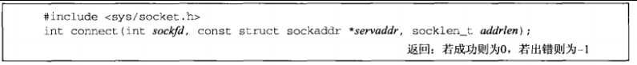

客户端调connect函数前不必须调bind，因为内核会自动决定源地址与一个随机空闲端口作为本端地址。

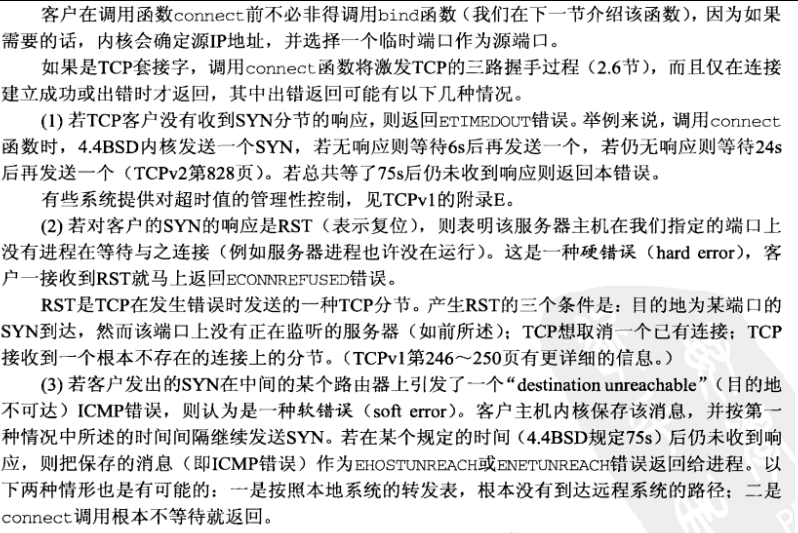
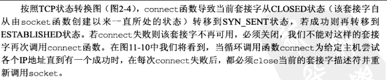

#### 4.4 bind函数
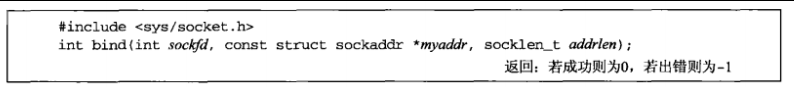

bind函数指定的都是自己的地址，客户端指定自己发出数据的地址（从哪个口发出），服务端指定自己接收的地址（只有目的是该地址的才会到此socket上），客户端不指定地址则按路由内核选择发出地址，服务器不指定地址则将SYN的目的地址作为自己的地址。不指定端口则用随机端口，一般服务器需要指定端口。

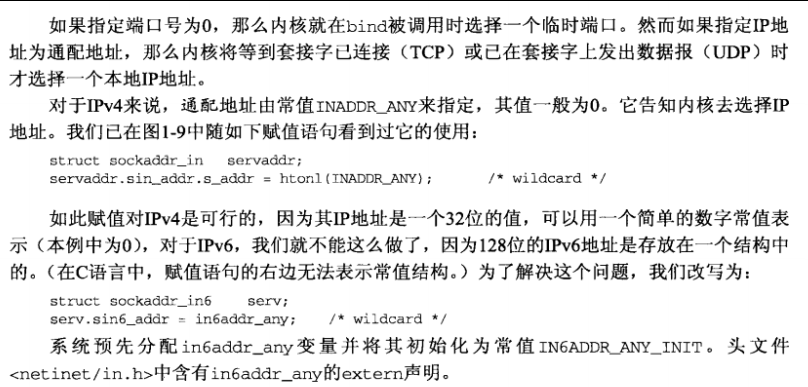

getsockname获取地址与端口，包括随机端口值。

#### 4.5 listen函数
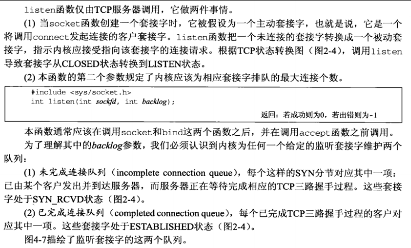
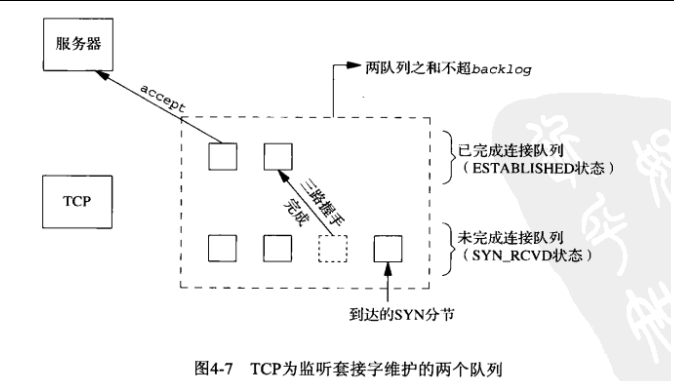

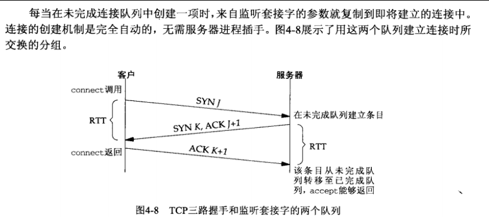
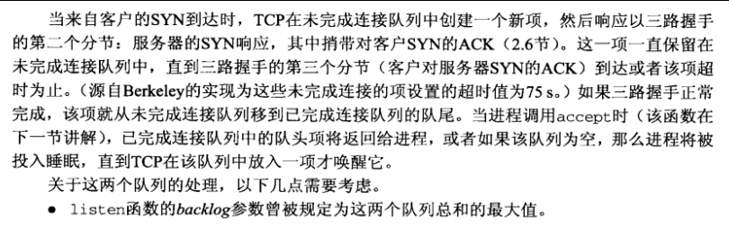

#### 4.6 accept函数
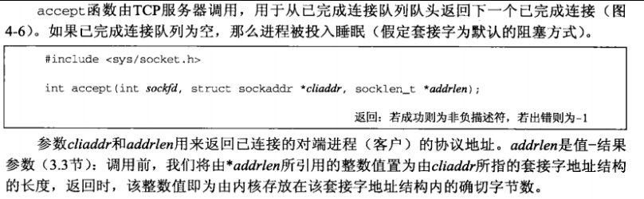

#### 4.7 fork函数与exec函数
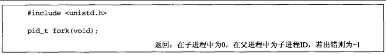

#### 4.8 多进程并发服务器

多进程版本的并发服务器：文件描述符存在引用计数，父进程关闭socket不会引起发送FIN，而是减小引用计数，只有当引用计数变为0的时候才是真正关闭发送FIN的时候。shutdown函数会触发发送FIN。

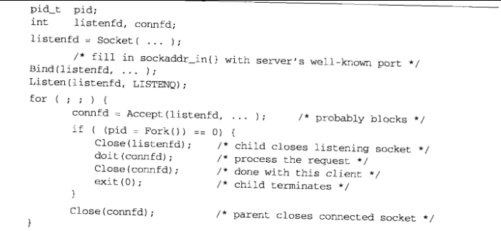

#### 4.9 close函数
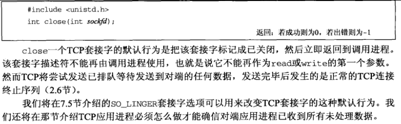

#### 4.10 getsockname与getpeername
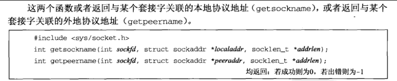

### 第五章 TCP客户端、服务器示例
#### 5.6 正常启动

#### 5.7 正常终止
注意捕获SIGCHID信号，否则子进程僵死。

#### 5.8 POSIX信号处理
SIGKILL、SIGSTOP无法被捕获并且无法被忽略，SIGIO、SIGPOLL、SIGURG需额外工作，SIG_IGN、SIG_DFL，大多默认终止进程，SIGCHID、SIGURG默认忽略。

处理函数：void handler(int signo)

signal、sigaction函数捕获信号。

#### 5.9 处理SIGCHID信号
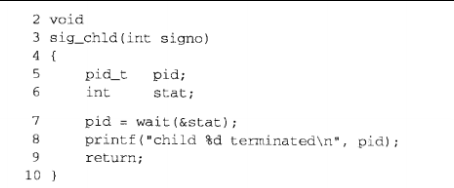

防止子进程僵死，就需要捕获SIGCHID或者将子进程detach掉。

注意：需要关注慢系统调用被信号中断的情况，当被中断时，系统调用会返回错误，errno会被设置为EINTR，此时需要手动继续调用慢系统调用。

#### 5.10 wait函数与waitpid函数
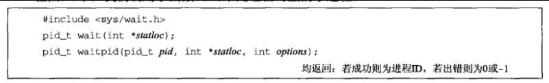

5.9信号处理的问题：unix信号一般是不排队的，也就是当出现多次触发时，最终只会调用一次处理函数，而不会记录次数。比如多个子进程结束，假如他们都是同一时间发送SIGCHID并同一时间到达父进程，最终父进程会执行一遍SIGCHID信号处理函数，导致其中只有一个被正常结束，剩余全部僵死，实际情况是可能执行未知次处理函数，据信号到达时间定。

解决方式：用waitpid，指定WNOHANG参数，循环获取已结束子进程的状态。

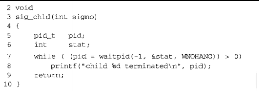

#### 5.11 accept返回前连接终止
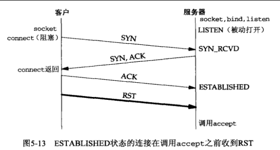

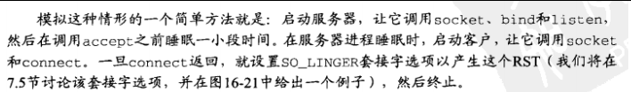

POSIX规定，此时accept返回errno为ECONNABORTED。

#### 5.12 服务器进程终止
当服务器进程崩溃，其描述符会被关闭，此时会给客户端发送FIN，此时客户端则会自动发送ACK，此时服务器端连接（netstat -a）显示服务器端处于FIN_WAIT2阶段，客户端则处于CLOSE_WAIT阶段，表明服务器端不再发送数据，但客户端可能继续发送数据。若此时客户端继续发送数据，服务器端收到后，发现该套接字所在的进程已终止，此时就会发送RST给客户端。但客户端是看不见RST的（假设此时RST还未到达），此时调用read，由于已经收到服务端的FIN，则read直接返回0（表示EOF）。若RST已经到达，调read则会返回错误ECONNRESET错误（对方已复位）。

#### 5.13 SIGPIPE信号
当进程对一个已经收到RST的套接字继续写数据时，内核会发送SIGPIPE错误，写操作则返回errno=EPIPE错误，默认是终止进程，因此需要捕获该信号。

#### 5.14 服务器主机崩溃（服务器不可达且未正常发送FIN）
此时客户端TCP协议栈会不断重试发送TCP数据分节，但一直收不到服务器的ACK，当超时时，会给read返回ETIMEDOUT错误，若是路由器判定不可达，返回一个“destination unreachable”的ICMP消息，则返回的是EHOSTUNREACH或ENETUNREACH错误。

SO_KEEPALIVE，定期检测服务器是否可达。上述只有当发送数据时才会检测到服务器不可达。

#### 5.15 服务器崩溃关机后重启
对于客户端发送的数据，服务器返回RST，当客户端读时，则出现ECONNRESET错误。

#### 5.16 服务器关机
当关机时，init进程会给所有进程发送SIGTERM信号（可捕获，默认终止进程），一段时间后发送SIGKILL给所有进程，此时进程会关闭描述符，发送FIN给客户端，一旦客户端接收到FIN，则立马可读（epoll等，就不会阻塞在write等系统调用上），客户端就能立马知道。

### 第六章 IO复用：select、poll
#### 6.2 IO模型
+ 阻塞IO
+ 非阻塞IO
+ IO复用
+ 信号驱动式IO
+ 异步IO

##### 6.2.1 阻塞IO
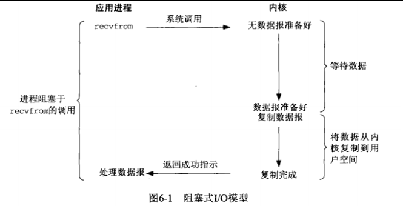

##### 6.2.2 非阻塞IO
给套接字设置为非阻塞式，当需要休眠阻塞时，返回错误而不是阻塞。比如返回EWOULDBLOCK错误。

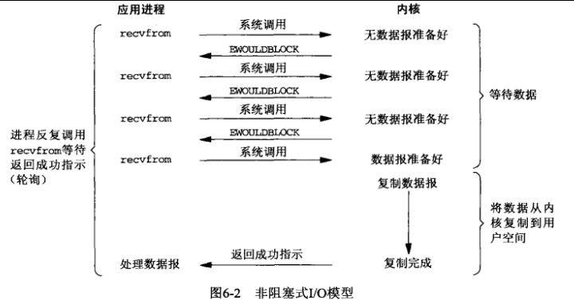

##### 6.2.3 IO复用模型
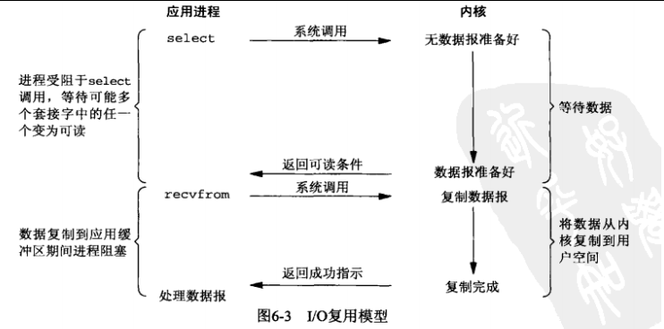

##### 6.2.4 信号驱动式IO
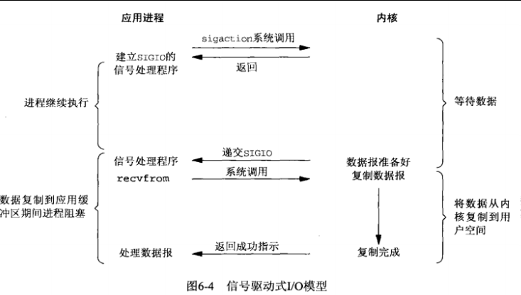

##### 6.2.5 异步IO
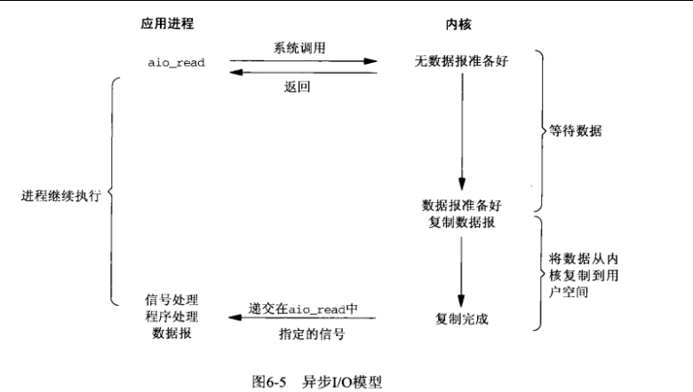

##### 6.2.6 IO模型对比
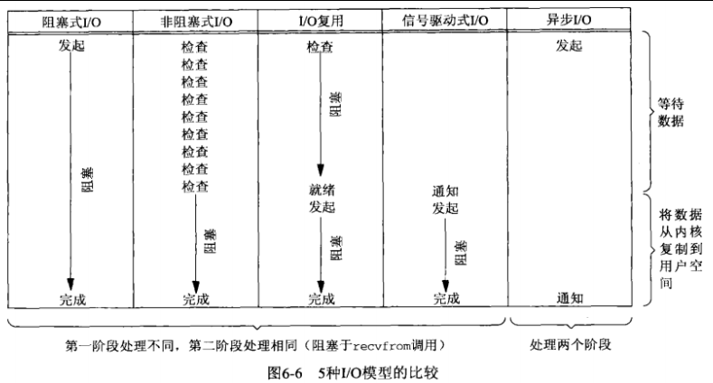

#### 6.3 select函数
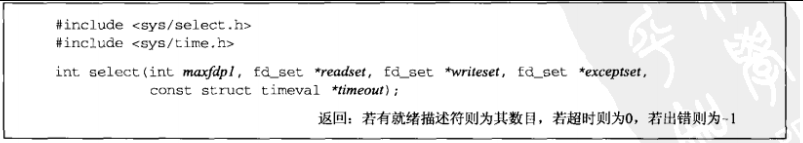
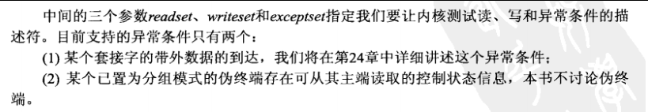
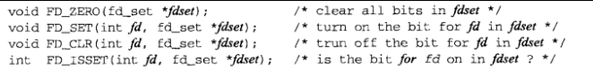

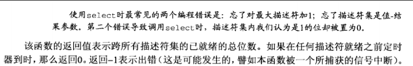

select局限：遍历+描述符有限（最大1024）。

##### 6.3.1 描述符就绪条件
可读条件：

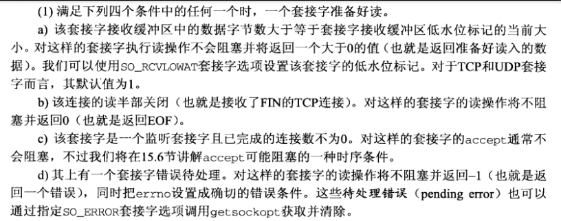

可写条件：

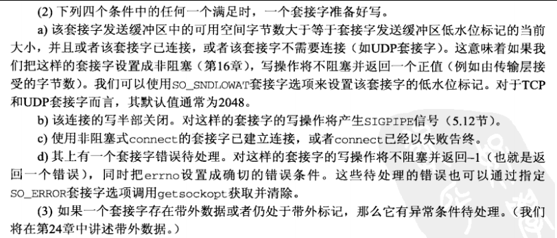

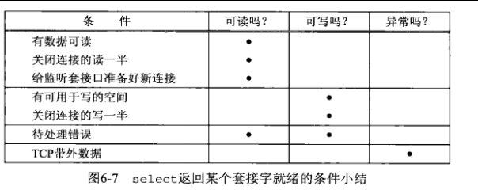

##### 6.3.2 select的最大描述符数
select支持的描述符数量有上限。

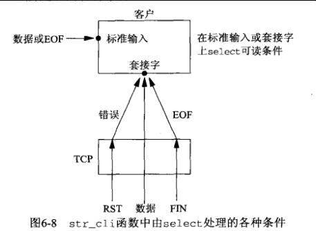

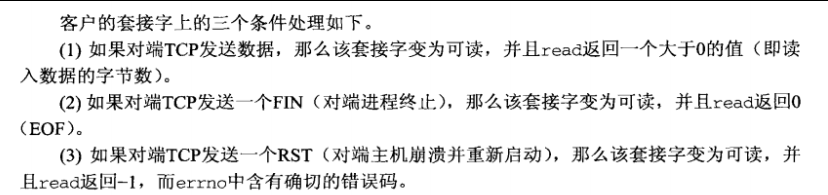

#### 6.6 shutdown函数
无视socket描述符引用计数，直接触发发送FIN。支持半关闭（关闭写），close是全关闭。

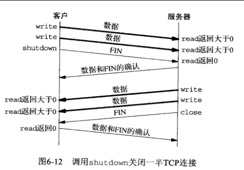

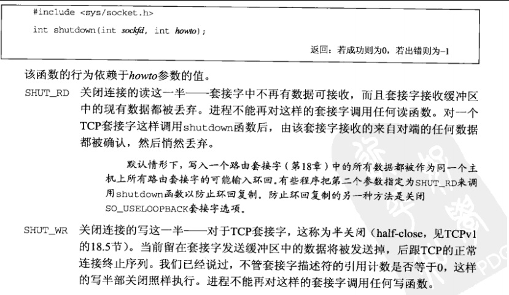
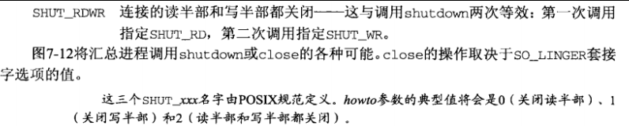

#### 6.10 poll函数
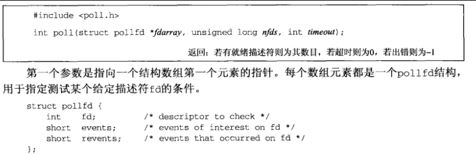
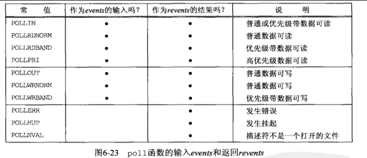

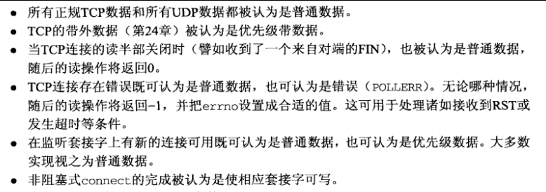
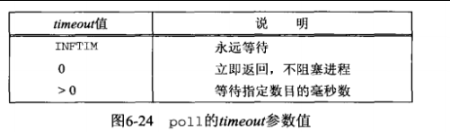

poll函数：描述符个数不受限，但仍需遍历获取到就绪的描述符。

### 第七章 套接字选项
#### 7.2 getsockopt与setsockopt

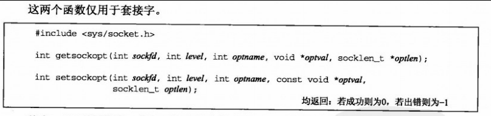
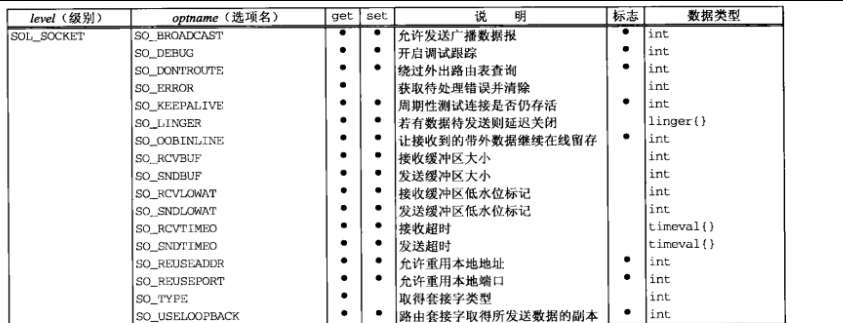
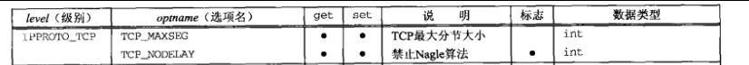

支持选项名未完：详见151页。

#### 7.3 检查选项是否支持并获取默认值
注意如何写代码，并且注意其中重要的选项。

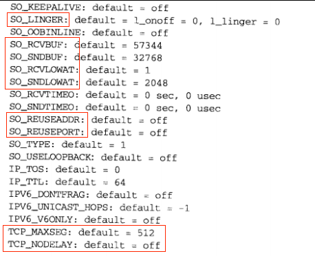

#### 7.4 套接字状态（部分从监听套接字继承）
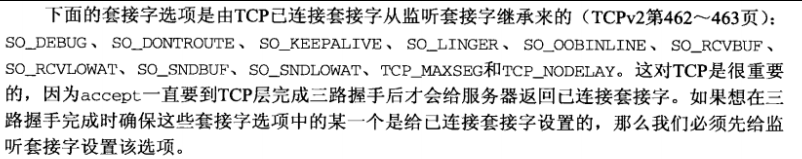

#### 7.5 通用套接字选项
##### 7.5.1 SO_BROADCAST
在支持广播的网络上，并且在数据报套接字上，设置广播能力，若未开启本设置，并且给出的目的地址为广播地址，则返回EACCES错误。

##### 7.5.2 SO_DEBUG
为TCP开启debug功能，对于发送接收的数据，保存缓存。

##### 7.5.3 SO_DONTROUTE
不通过适当接口（根据目的地址，路由表的子网等确定的本地适当接口）发送数据。

##### 7.5.4 SO_ERROR
保存待处理错误，常用获取方式：IO复用、信号驱动的IO模型（此时给进程产生SIGIO信号）。SO_ERROR选项获取的是so_error的值，获取后so_error重置0，通过getsockopt获取SO_ERROR时，也会重置。在read无数据返回时，若so_error非0，则read返回-1，errno的值就是so_error，且so_error重置为0，若有数据待读时，返回数据而不是错误。write同理，当so_error非0，调write会返回错误。

##### 7.5.5 SO_KEEPALIVE（以及各种检测TCP条件的方法）
2h探测保活，给对端发送保活分节。若回复ACK，则用户进程无任何通知（无感知保活分节）；若无回复，则自动尝试重传，超时时关闭socket并返回错误ETIMEOUT，若其中存在ICMP报错，则超时时返回该ICMP报错信息，常见的为EHOSTUNREACH（网络故障不可达，或者路由器已检测对端崩溃）；若回复RST，说明对端崩溃已重启，socket关闭，返回错误ECONNRESET。

检测对端是否崩溃或者网络故障（对应不会主动发FIN的情况，进程崩溃的情况会自动发FIN），一般服务器使用，检测崩溃的客户端，防止长时间占用资源。

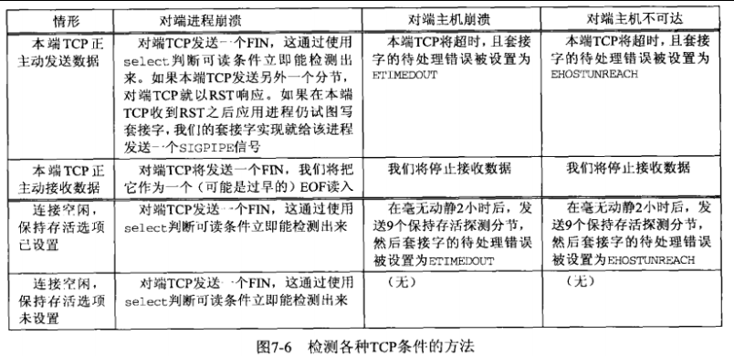

##### 7.5.6 SO_LINGER
指定close函数对于面向连接的协议（TCP、SCTP）的操作方式。默认close立即返回，若有数据残留在套接字发送缓冲区时，系统会试着把这些数据发送给对端。

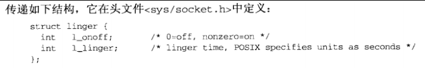

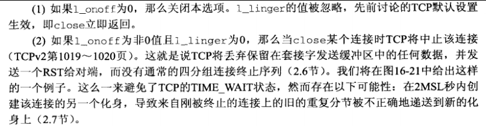

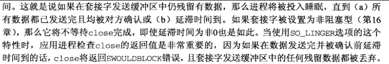

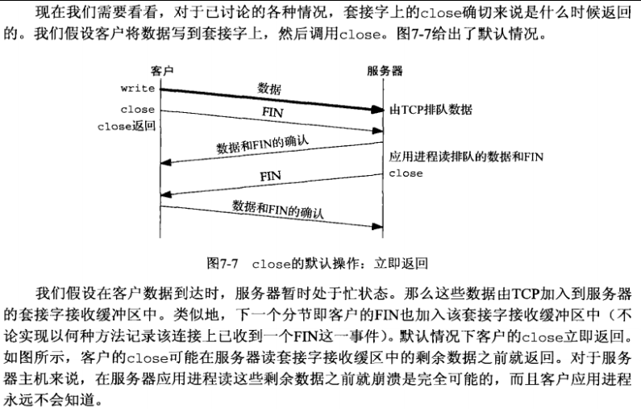

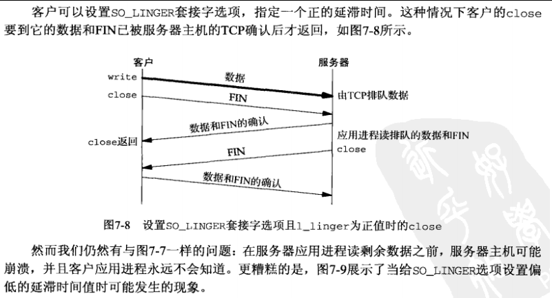
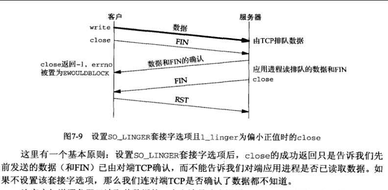

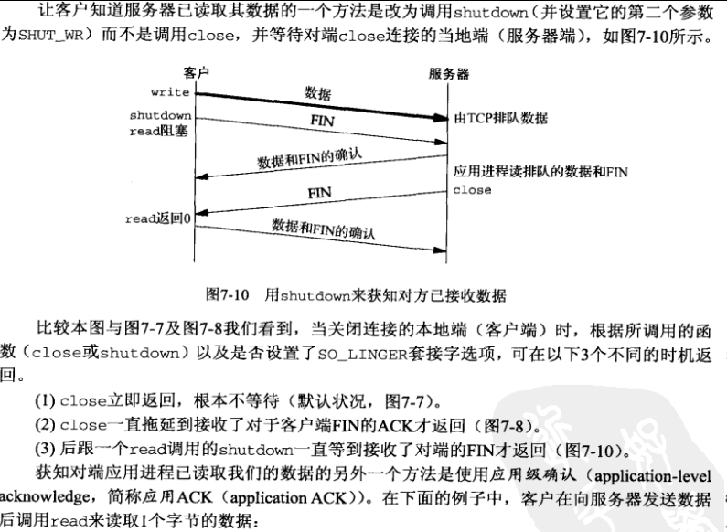
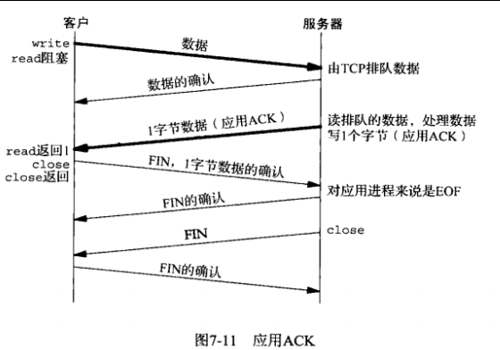

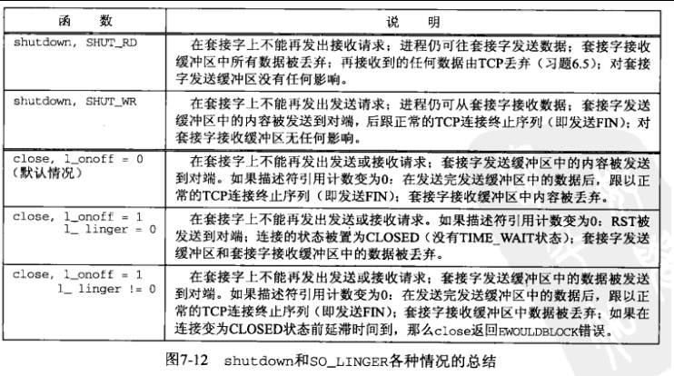

##### 7.5.7 SO_OOBINLINE
带外数据保留在正常输入队列中，接收函数不能通过MSG_OOB标志读取带外数据。

##### 7.5.8 SO_RCVBUF与SO_SNDBUF
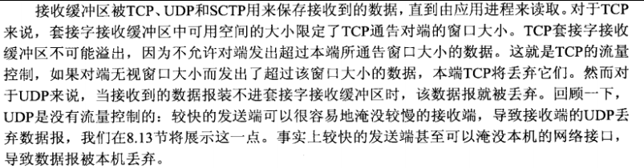
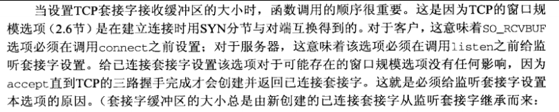

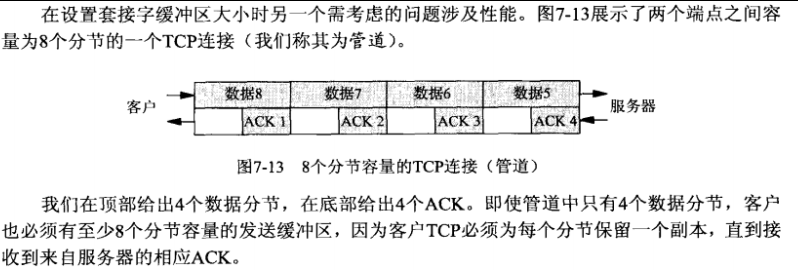

##### 7.5.9 SO_RCVLOWAT与SO_SNDLOWAT
主要提供给IO多路复用api用（比如select），接收低水位标记指的是让select可读时套接字接收缓冲区内所需数据量，对于TCP、UDP，该值默认为1；发送低水位标记指的是让select可写时套接字发送缓冲区内所需的可用空间，对于TCP一般默认2048，UDP没有发送缓冲区，但存在发送缓冲区大小属性，当发送缓冲区大小大于发送低水位标记，UDP总是可写。

##### 7.5.10 SO_RCVTIMEO与SO_SNDTIMEO
给发送与接收设置一个超市值，默认禁止超时。影响读：read、readv、recv、recvfrom、recvmsg；影响写：write、writev、send、sendto、sendmsg。

##### 7.5.11 SO_REUSEADDR与SO_REUSEPORT

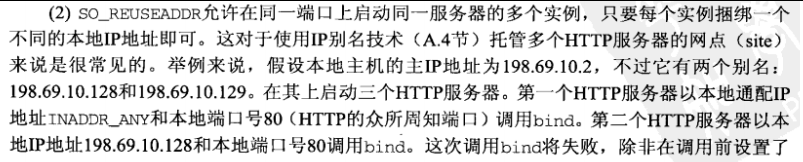
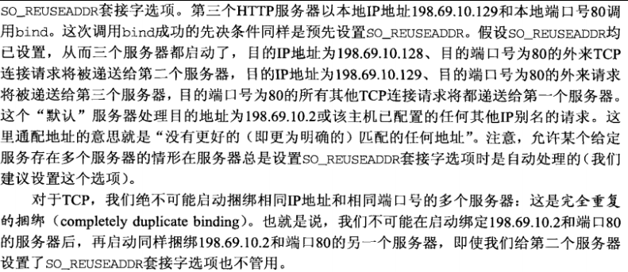
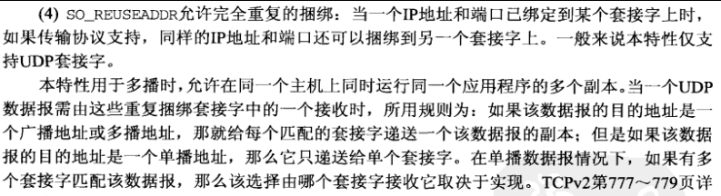

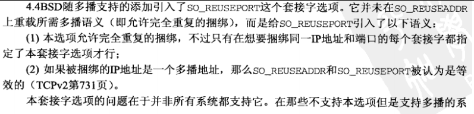
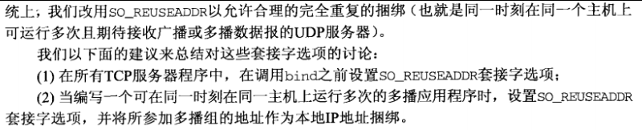

##### 7.5.12 SO_TYPE
返回SO_STREAM或者SO_DGRAM等套接字类型。

##### 7.5.13 SO_USELOOPBACK
仅用于路由域套接字。

#### 7.6 IPV4套接字选项
级别为IPPROTO_IP。

##### 7.6.1 IP_HDRINCL
自定义IP首部。

##### 7.6.2 IP_OPTION
设置IP首部中的IP选项。

##### 7.6.6 IP_TTL
设置IP首部中的TTL值，TCP、UDP默认为64。

#### 7.8 IPV6套接字选项

#### 7.9 TCP套接字选项
级别为IPPROTO_TCP。

##### 7.9.1 TCP_MAXSEG
设置MSS最大分节大小，与对端通告的MSS取较小值，同时也受MTU的影响，综合下来控制了发送的数据分节的大小。

##### 7.9.2 TCP_NODELAY
用于禁止Nagle算法，该算法默认是开启的。该算法就是当网络上存在未确认的小分组时，后续的小分组不会立即发送出去，而是等到确认返回，或者累积满为一个MSS才会发送。

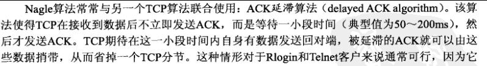
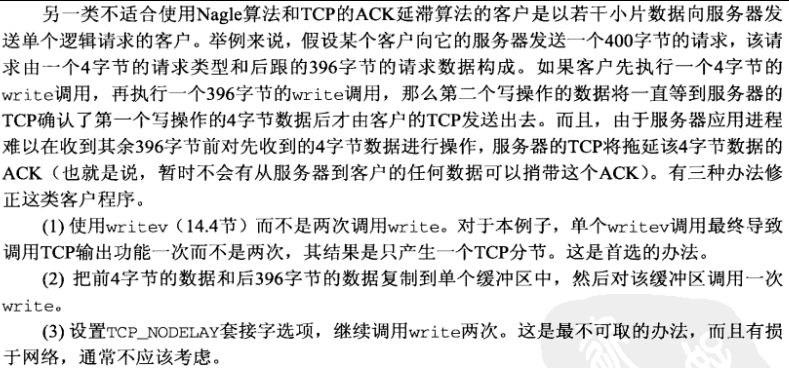

#### 7.10 SCTP套接字选项

#### 7.11 fcntl函数（设置套接字为非阻塞）
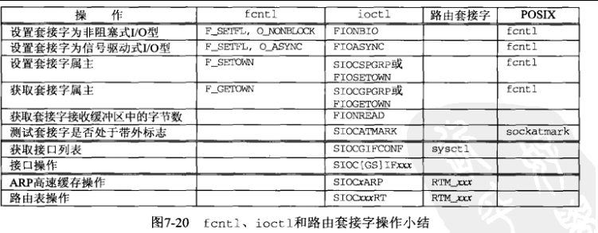

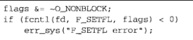

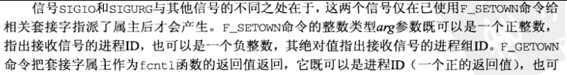
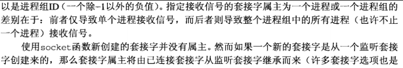

### 第八章 基本UDP套接字编程
#### 8.1 概述
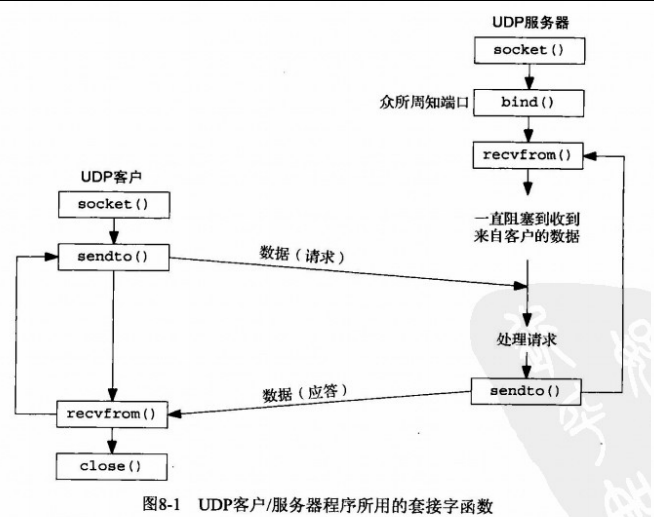

#### 8.2 recvfrom与sendto
此处sendto函数最后一个参数错误，是socklen_t，是一个值而不是指针。

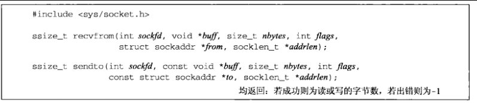
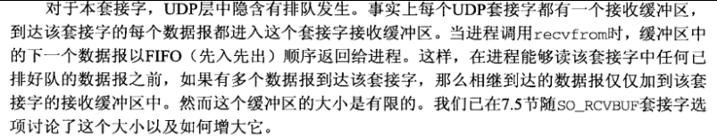

#### 8.7 数据报丢失
给recvfrom设置一个超时时间，后续会关注是请求丢失还是响应丢失。

#### 8.8 验证响应的收到
通过验证收到的消息的IP地址是否是服务器验证，但当服务器绑定的是通配地址，并且服务器为多宿（存在多个IP地址），此时内核会自动选择源IP（只有当socket绑定的地址是通配的才会发生），此方法就会出错，解决办法之一就是验证域名，或者让服务器给全部IP均绑定到各自的socket上，然后基于IO复用来回复消息，这样回复的消息源IP是当前socket绑定的地址。

#### 8.9 服务器进程未运行
UDP在发送数据前，可能会先发送ARP数据确定对端，假如未运行，则返回一个端口不可达的ICMP错误，该错误只会异步返回，不会在sendto处返回。

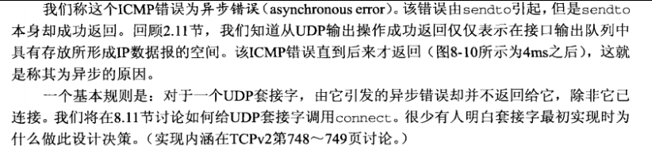

#### 8.11 UDP的connect函数
UDP调用connect不会给对端发送任何数据，只是在本地保存对端IP与端口，同时搜索路由表选定本地IP与端口。

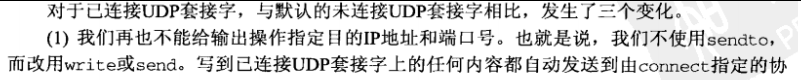
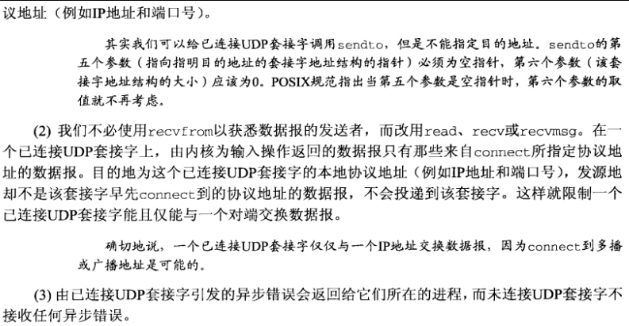
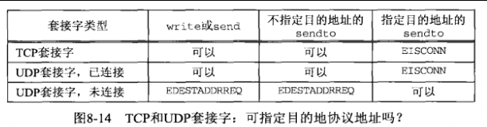

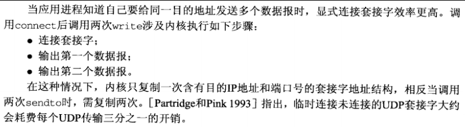

#### 8.12 UDP客户端
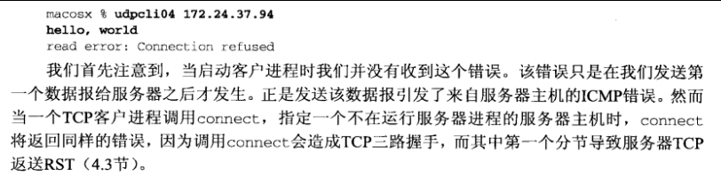

UDP只有在发送数据后才会收到ICMP错误，但TCP在connect时就会收到错误。

#### 8.13 UDP缺乏流量控制
netstat -s -p udp  显示UDP丢失的数据量

UDP当缓冲区满自动丢失数据，并且不告知用户程序。

通过修改SO_RCVBUF，能使得UDP能接收更多数据，但无法改变其缓冲区满丢失数据的情况。

#### 8.15 使用select的TCP、UDP回射程序
注意：TCP端口与UDP端口独立，两者同时绑定相同的IP与端口不冲突。

### 第十一章 名字与地址的转换
#### 11.3 gethostbyname函数
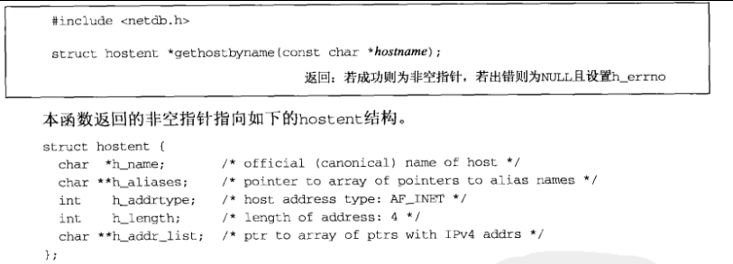

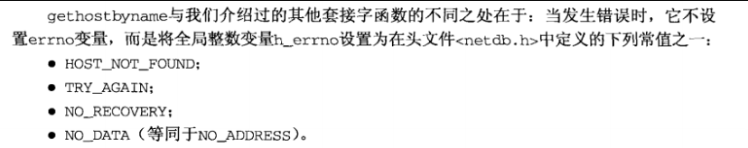

#### 11.4 gethostbyaddr
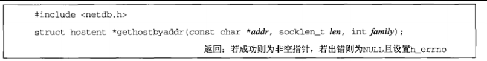

#### 11.5 getservbyname与getservbyport
#### 11.6 getaddrinfo（V4 V6通用）
#### 11.13 利用getaddrinfo实现协议无关的服务

### 第十二章 IPV4与IPV6的互操作性

### 第十三章 守护进程与inetd超级服务器

### 第十四章 高级IO函数

### 第十五章 unix域协议

### 第十六章 非阻塞式IO
#### 16.1 概述
+ **读：read、readv、readn、recv、recvfrom、recvmsg**

对于阻塞套接字：当套接字中无数据可读，调用上述读api的线程就会挂起睡眠，直到有数据到达可读。对于tcp数据流，也就**是至少有一个字节**的数据到达，若想等到固定数目数据可读再唤醒，可用readn或者MSG_WAITALL标志。对于UDP，则是至少有一个数据报到达（不可能只到达完整数据报的部分，数据报总是一个包，即使分片了（可能导致问题，是用户设计缺陷，需要减少包大小防止分片），也是一个包）。

对于非阻塞套接字：当TCP套接字中不满足至少1字节数据可读，或者UDP套接字中存在一个完整数据报可读，则读api返回-1，errno设置为**EWOULDBLOCK**（同时可判断EAGAIN，下面同理）。

+ **写：write、writev、send、sendto、sendmsg**

对于阻塞套接字：写api会将用户进程空间缓冲区的数据拷贝到内核里套接字的发送缓冲区中，对于阻塞套接字，当发送缓冲区无空间时，就会导致线程挂起，直到发送缓冲区有空间。

对于非阻塞套接字：发送缓冲区**无空间可写**时，立即返回**EWOULDBLOCK**。

+ **接受连接：accept**

对于阻塞套接字：无新连接到达则挂起睡眠。

对于非阻塞套接字：无新连接返回EWOULDBLOCK。

+ **发起连接：connect**

对于阻塞套接字：connect会使得客户端发送三次握手中的第一个分节SYN，只有当客户端收到对这个SYN的ACK后才会返回，也就是至少阻塞一个RTT的时间。

对于非阻塞套接字：connect立即返回，对于不能立即建立连接的情况（比如可能是存在一定延迟的远端服务器），触发三次握手中的第一个分组发送，并且返回EINPROGRESS错误；对于能立马建立连接的情况（比如客户端与服务器在同一主机上），connect正常立即返回。

#### 16.2 非阻塞读写client

#### 16.3 非阻塞connect
目的：在RTT时间内，尽可能处理多的事情，比如处理其它服务的请求，或者尽可能多的发起连接；但当网络环境较差时，可能使得网络环境更差（多个连接共同抢占宽带资源）。

对套接字设置非阻塞后再调用connect，如果连接已启动（三次握手已启动）但尚未完成（未收到对方的ACK），就会返回EINPROGRESS错误，connect本身返回-1。如果立马连接成功则返回0。

对上述套接字调select或者epoll后，当连接成功或者失败的时候，套接字会变得可读或者可写（一般是检测可写），此时可通过getsockopt+SO_ERROR选项获取状态，若返回0，可能存在错误（通过传回参数error检查）；若返回-1，一定发送错误，检查errno。可能出现的错误有ECONNREFUSED、ETIMEOUT等。

除此之外，还有其它检测方法，如调getpeername、read长度为0的数据、再次调connect。

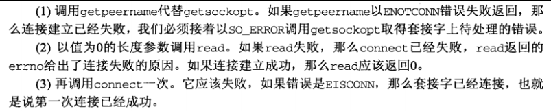

可能出现connect被中断的情况，即使是在非阻塞的情况下，此时会返回错误EINTR，但三次握手已经开始，不必再次调用connect，否则返回EADDRINUSE错误。

**建议看tinyev项目，学习里面使用的非阻塞connect的处理方式。**

#### 16.6 非阻塞accept
**注意看SO_LINGER的设置：**特殊情况可能导致服务器阻塞于accept上，即使使用了IO多路复用。当客户端发送SYN后，客户端立马发送了RST，这时服务端已经从epoll或者select返回，但还未来得及调用accept，此时若服务端监听描述符为阻塞的，则导致服务端阻塞于accept上（因为收到SYN后会放入待连接队列，收到RST则从队列中删除，此时若调accept则可能出现队列为空而阻塞），部分实现不会阻塞，则会返回ECONNABORTED或者EPROTO错误。对于阻塞的情况，将监听套接字设置为非阻塞，则会返回EWOULDBLOCK错误，这样就能避免出现阻塞的情况发生。

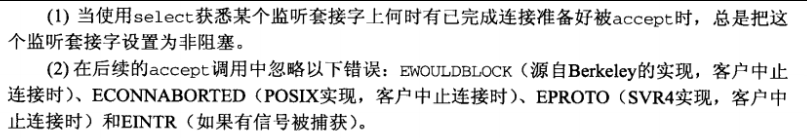

看accept4接口，可设置非阻塞。

### 第十七章 ioctl操作
略

### 第二十章 广播
略

### 第二十一章 多播
略

### 第二十二章 高级UDP编程
略

### 第二十六章 线程
略

### 第二十七章 IP选项
略
