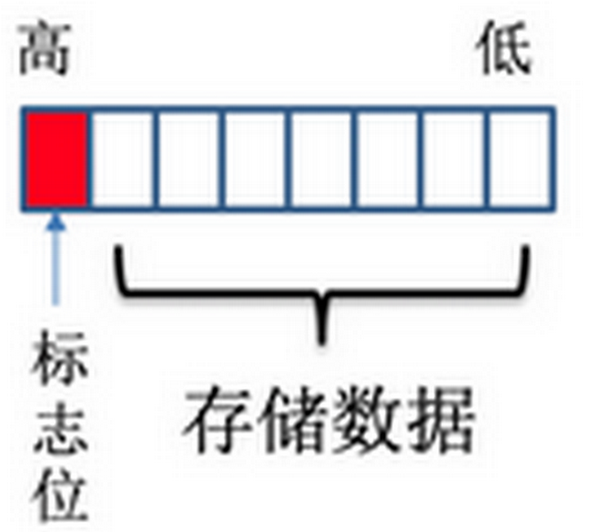

# protobuf编码原理

[返回主页](../../README.md)

## 基础
protobuf是一种跨平台的序列化数据编码格式，其具有压缩率高、安全、前向兼容性高、可扩展性高的特点，常用于数据存储、RPC数据交换，核心采用TLV编码的方式。

### 消息示例
下面是一个protobuf的协议示例，定义了一个helloworld消息，其中包含三个成员，字段序号为1类型为int32的id，字段序号为2类型为string的成员str。字段序号为3类型为int32的opt是一个可选的成员，即消息中可以不包含该成员。
```cpp
message helloworld 
{ 
   required int32     id = 1;  // ID 
   required string    str = 2;  // str 
   optional int32     opt = 3;  //optional field 
}
```
其中int32和string为protobuf支持的消息类型，其支持int32、int64、uint32、uint64、sint32、sint64、bool、enum、fixed64、sfixed64、double、string、 bytes、embedded messages、packed repeated fields、fixed32、sfixed32、float。

required前置字段，则表明该字段可能的个数。当序列化反序列化数据的时候，会检测设置的数据是否和protobuf里设置的规则一致。
- required：必须有一个
- optional：0或者1个
- repeated：任意数量（包括0）
- singular：0或者1个，但不能多于1个 （proto3）

### 基础编码
```
key+(len)+value | key+(len)+value | key+(len)+value | key+(len)+value ...
```
对于上述的helloworld消息，其编码方式为，对三个字段依次进行编码，顺序排列在字节流中。此处对id字段进行编码示例讲解。


- T：type，用于标识标签或者编码格式信息；
- L：length，定义后续的value的长度；
- V：value，业务数据。

对于id字段，tag部分保存了其类型int32（被称为wire_type）以及其字段序号1（被称为field_number）；由于id字段的值是固定长度的（int32在protobuf中为固定长度），因此不包含length（只有类型2需要length，其余都是固定长度不需要length字段）；value字段则保存的实际业务值，其采用zigzag+varint方式进行编码存储。


| 类型 | 含义 | 适用类型 |  编码方式  |
|:--------:| :---------:|:--------:|:------:|
|    0    |   varint   |  int32, int64, uint32, uint64, sint32, sint64, bool, enum | zigzag + varint |
|    1    |   64-bit   | fixed64, sfixed64, double |  普通浮点数编码  |
|    2    |   有限不固定长度  |  string、bytes、嵌入类型、重复类型  |  TLV  |
|    5    |    	32-bit  |  fixed32, sfixed32, float  |  普通浮点数编码 |

#### tag编码
tag = (field_number << 3) | wire_type，用低三位存储wire_type，剩余部分存储field_number，然后对整个tag使用varint进行序列化。比如，对于id的编码值为`00001 000`，低三位为其wire_type值0，高位则为其field_number值1。整体为varint编码方式，最高位0表示tag字段只有一个字节，假如field_number过大，则需要多个字节表示tag，此时这多个字节按varint编码方式进行编码。

### varint编码
一个字节只有低7位表示实际数据，最高位表示后续字节是否是存储该实际数据的字节。

比如对300进行varint编码，`300 = 100101100`，由于超过了7位，则首先取出低7位，作为编码后的第一个字节`010 1100`，同时为了表示后续还有字节表示该值，在最高位增加一位1，也就是最终编码为`1010 1100`；去除低7位，剩余`10`，则继续按照上述方式进行编码，由于不足7位，则就按`10`进行编码，同时最高位设置为0，表示varint编码结束，即`0000 0010`，最终300经过varint编码后码流结果（从低字节到高字节）为`1010 1100 0000 0010`。


### zigzag编码


### 复杂结构编码


