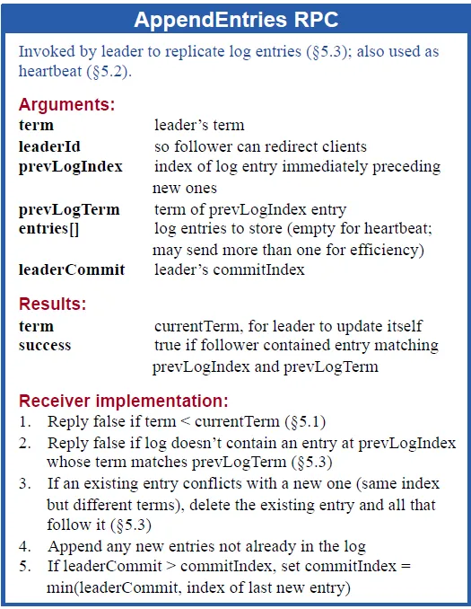
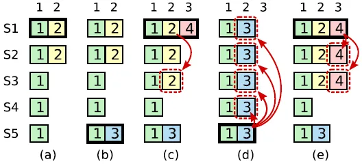

# raft分布式算法

[返回主页](../../README.md)

# 原理

1. 解决的问题：防止单点服务器故障导致的数据丢失问题，同时防止多节点下数据不一致、乱序的问题，N个节点允许(N-1)/2个节点故障。
2. 角色：leader、candidate、follower
3. 客户端只与leader交互，操作分为两阶段，先写日志，超过半数节点同步日志后才提交。客户端首先向leader发送请求，leader会先写入日志，然后将操作日志发送给follower，follower同步后回复leader，当半数节点同步后，leader则会提交该操作并返回给客户端，同时通知follower提交操作。
4. leader保持与选举：leader发送消息或者心跳包，follower重置定时器（随机超时时间），当定时器超时，follower转变为candidate，并且将自己的term+1，然后开始竞选leader。candidate向其它节点发送投票请求，超半数通过则成为leader。若选举失败，则会等待超时重新继续选举（此时term会继续增大，为了防止这种情况发生，可能存在一个预选举操作，就是先发送一个选举请求，大多数节点同意则开始选举）。其余的节点当收到比自己的term大的选举请求，会将自己转变为follower并且更新自己的term为最大的，假如收到的选举请求term小或者等，则拒绝。除此之外，follower还必须遵守投票限制，也就是被选举的candidate的日志必须比自己的更新（就是最后一条日志term更大或者term相同的情况下index更大）。
5. 投票限制：每个节点一个任期只能投一次，并且被投的节点，必须有更大的term与更新的日志，因此投票请求中，会携带自己的term、节点id、最后一条日志的term与index，其中日志的term必须大，或者日志term相等时index大于等于才认为是更新的日志。
6. 当出现分区，只有大多数节点那个分区能够正常工作，即使少数节点区有leader，也不可能提交。
7. leader不可能删除日志，但同步的节点可能需要删除不一致的日志，leader选举的时候，保证了leader内一定是最新的日志。
8. raft日志复制：
  a. leader只追加日志：原因是leader有最新日志，因此不能删除，只能追加；
  b. 如果俩日志的index和term相同，则这俩日志肯定相同，原因是一个任期只会有一个leader，即使分区，当合并的时候，也会同步到leader节点的日志；
  c. 若俩日志相同，则它之前的日志也一定相同，原因是写入日志前会检查前一个日志是否一致，从而递归保证当前index前的日志全部一致；
9. 日志同步：leader发送同步请求给follower，携带leader的term、id、当前发送日志列表之前那个日志的index以及term（递归保证以前的日志一致）、已经提交的日志index（确定哪些日志可以提交）、日志列表（需要同步的日志，如果为空则为心跳包），首先检查leader的term，若小于follower自身的term，说明过期则拒绝请求，否则对比先前日志的index与term，一致时写入新日志列表并返回成功，否则就删除对应index后续的日志，返回失败，后续leader会减小先前日志的index重新尝试发送（遍历尝试找到日志相同的位置）。若成功，最后会对比leader携带的已提交日志index与自身的提交index，看是否能够提交日志（min（leaderCommit，最新日志的index）），同时定期进行快照，同时删除无用日志，防止日志过大。

10. 日志提交：当日志存在于大多数节点时就会提交，但限定leader只能提交自己任期内的日志，先前任期未提交但同步的日志只能通过当前任期日志的提交而被间接提交。为的是防止(c、d)这种情况发生（防止c中leader提交了先前任期的日志，但换leader后）。

状态a存在的意思是，s3、s4、s5处于同一状态， 这样s5才能获取到3/4/5的票成为leader；状态d中s5能成为leader的原因是，其term为5，大，其次是最新日志为term3index2，相比于2/3/4都新，因此能获票成为leader，此时若同步日志3，就会覆盖掉日志2，假如允许状态c中提交过往任期内的日志，就可能存在覆盖的问题。但假如只允许当前任期日志提交，间接提交过往任期内的日志，则当日志4达成共识后，未来的leader肯定必须同步到4，否则未拥有最新日志，也就不可能成为leader，此时日志4同步了，过往任期内的日志2肯定也同步了，也就不会出现覆盖的问题。
