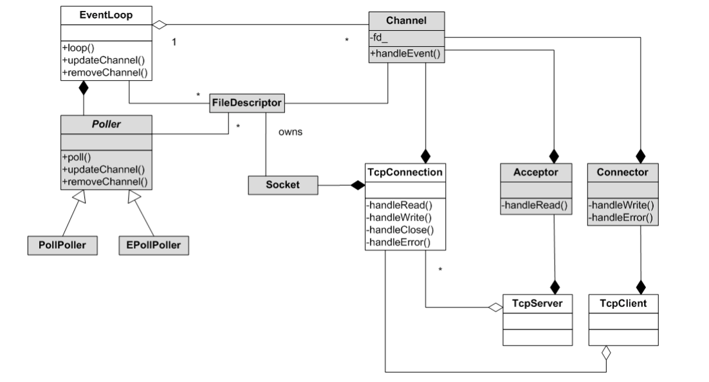

# this is reactor 服务器

[返回主页](../../README.md)

## 整体架构

> 基于reactor的服务器模型，主要包括了EventLoop类、Pooler类、Channel类、TcpConnection类、Accepter类、Connector类六个核心类。还包括基于此建立的TcpLcient和TcpServer类。



## Pooler类（事件分离器）
> 内部类，只用于EventLoop类中，主要是对select、pool、epoll这几种IO复用模型接口的封装，主要功能包括保存关注的事件列表(使得能够通过`描述符fd`获取到对应的channel对象,可通过`map`实现或者通过类似`epoll_event`内保存的用户数据指针实现均可)、将事件通过接口`epoll_ctl`进行增删改、通过接口`epoll_wait`进行阻塞式等待事件到来或者超时返回。

```cpp
class EventLoop;
class Channel;

class EPoller: noncopyable
{
public:
    typedef std::vector<Channel*> ChannelList;

    explicit
    EPoller(EventLoop* loop);
    ~EPoller();

    void poll(ChannelList& activeChannels);
    void updateChannel(Channel* channel);

private:
    void updateChannel(int op, Channel* channel);
    EventLoop* loop_;
    std::vector<struct epoll_event> events_;
    int epollfd_;
};
```

## EventLoop类
> 核心外部类，主要作用就是`1.调用事件分离器等待就绪事件；2.分发就绪事件给相应的事件处理器；3.调用处理器中的回调函数；4.处理其它任务队列中急需处理的任务以及超时事件；5.重复上述过程`。其作为核心功能组件，管理着部分对象的生命周期：包括创建、删除时间分离器`Pooler`，用于监听IO事件；创建、删除定时器队列`TimerQueue`，用于创建定时任务或者周期任务；管理同步队列以及提供唤醒功能，用于处理需立即处理的任务或者存放委托任务。除此之外，EventLoop类还以指针的形式提供给其它类使用，目的主要为判断是否为主loop线程。

```cpp
class EventLoop: noncopyable
{
public:

    EventLoop();
    ~EventLoop();

    void loop(); // 事件分离器
    void quit(); // thread safe

    // 任务委托
    void runInLoop(const Task& task);
    void runInLoop(Task&& task);
    void queueInLoop(const Task& task);
    void queueInLoop(Task&& task);

    // 定时任务与周期任务 返回定时器指针由创建任务的对象负责取消任务 保证Timer的生命周期由同一对象管理
    Timer* runAt(Timestamp when, TimerCallback callback);
    Timer* runAfter(Nanosecond interval, TimerCallback callback);
    Timer* runEvery(Nanosecond interval, TimerCallback callback);
    void cancelTimer(Timer* timer);

    // 唤醒
    void wakeup();

    // IO事件注册接口
    void updateChannel(Channel* channel);
    void removeChannel(Channel* channel);

    // 多线程下的主loop线程的区分
    void assertInLoopThread();
    void assertNotInLoopThread();
    bool isInLoopThread();

private:
    void doPendingTasks();
    void handleRead();
    const pid_t tid_;
    std::atomic_bool quit_;
    bool doingPendingTasks_;
    EPoller poller_;
    EPoller::ChannelList activeChannels_;
    const int wakeupFd_;
    Channel wakeupChannel_;
    std::mutex mutex_;
    std::vector<Task> pendingTasks_; // guarded by mutex_
    TimerQueue timerQueue_;
};

```

### loop接口
> 主要作用为，调用事件分离器，等待就绪事件到来，在返回后，依次调用就绪`channel`中定义的事件处理回调函数，处理完成就绪事件后，再处理委托保存的任务。注意，其中的定时任务队列，是通过`timerfd`的形式提供，也就是作为一个`描述符`的形式提供，在等待时间到达后，该描述符就会变为就绪态，时间分离器也就会返回，然后调用对应的`timerfd`对应的任务函数。

```cpp
void EventLoop::loop()
{
    assertInLoopThread();
    TRACE("EventLoop %p polling", this);
    quit_ = false;
    while (!quit_) {
        activeChannels_.clear();
        poller_.poll(activeChannels_);
        for (auto channel: activeChannels_)
            channel->handleEvents();
        doPendingTasks();
    }
    TRACE("EventLoop %p quit", this);
}
```

### 任务委托接口
> 任务委托主要是runInLoop接口和queueInLoop接口。对于runInLoop接口，若调用者为主循环线程，则直接调用任务，若为其它线程，则通过queueInLoop接口将任务保存到任务队列，并且唤醒主循环线程去处理。queueInLoop接口则只简单将任务保存到任务队列并唤醒即可。

```cpp
void EventLoop::runInLoop(Task&& task)
{
    if (isInLoopThread())
        task();
    else
        queueInLoop(std::move(task));
}
void EventLoop::queueInLoop(Task& task)
{
    {
        std::lock_guard<std::mutex> guard(mutex_);
        pendingTasks_.push_back(std::move(task));
    }
    wakeup();
}
```

### 定时任务相关的接口
> 定时任务主要为四个接口，`runAt`为在指定时刻触发一次，`runAfter`则为在当前时刻之后固定时间后触发一次，`runEvery`则为当前时刻之后周期触发，`cancelTimer`则为取消定时器。这四种接口，均简单调用`TimerQueue类`的`addTimer`接口，关于定时器的封装逻辑，均处于`TimerQueue类`中，基本逻辑为，`TimerQueue`中通过创建`Timerfd`，将该`Timerfd`注册进时间分离器中，借此进行定时，当定时到达时，事件分离器返回，就会调用`TimerQueue`中指定的回调函数，在`TimerQueue`回调函数中则检测超时事件并处理，然后再次设置`Timerfd`的超时时刻，等待下一次超时时事件分离器返回。

```cpp
Timer* EventLoop::runAt(Timestamp when, TimerCallback callback)
{
    return timerQueue_.addTimer(std::move(callback), when, Millisecond::zero());
}

Timer* EventLoop::runAfter(Nanosecond interval, TimerCallback callback)
{
    return runAt(clock::now() + interval, std::move(callback));
}

Timer* EventLoop::runEvery(Nanosecond interval, TimerCallback callback)
{
    return timerQueue_.addTimer(std::move(callback),
                                clock::now() + interval,
                                interval);
}
```

## Channel类
> 内部类，目前仅提供给`Acceptor`、`Connector`、`EventLoop`、`TcpConnection`使用，对`描述符fd`以及对应可读、可写、错误、关闭时的回调函数的封装。同时保存有EventLoop对象指针，通过该指针来将`fd`注册进Pooler中监听事件。

```cpp
class EventLoop;

class Channel: noncopyable
{
public:
    typedef std::function<void()> ReadCallback;
    typedef std::function<void()> WriteCallback;
    typedef std::function<void()> CloseCallback;
    typedef std::function<void()> ErrorCallback;

    Channel(EventLoop* loop, int fd);
    ~Channel();

    void setReadCallback(const ReadCallback& cb)
    { readCallback_ = cb; }
    void setWriteCallback(const WriteCallback& cb)
    { writeCallback_ = cb; }
    void setCloseCallback(const CloseCallback& cb)
    { closeCallback_ = cb; }
    void setErrorCallback(const ErrorCallback& cb)
    { errorCallback_ = cb; }

    void handleEvents();

    bool polling;
    int fd() const
    { return fd_; }
    bool isNoneEvents() const
    { return events_ == 0; }
    unsigned events() const
    { return events_; }
    void setRevents(unsigned revents)
    { revents_ = revents; }

    void tie(const std::shared_ptr<void>& obj);

    void enableRead()
    { events_ |= (EPOLLIN | EPOLLPRI); update();}
    void enableWrite()
    { events_ |= EPOLLOUT; update();}
    void disableRead()
    { events_ &= ~EPOLLIN; update(); }
    void disableWrite()
    { events_ &= ~EPOLLOUT; update();}
    void disableAll()
    { events_ = 0; update();}

    bool isReading() const { return events_ & EPOLLIN; }
    bool isWriting() const { return events_ & EPOLLOUT; }

private:
    void update();
    void remove();

    void handleEventsWithGuard();

    EventLoop* loop_;
    int fd_;

    std::weak_ptr<void> tie_;
    bool tied_;

    unsigned events_;
    unsigned revents_;

    bool handlingEvents_;

    ReadCallback readCallback_;
    WriteCallback writeCallback_;
    CloseCallback closeCallback_;
    ErrorCallback errorCallback_;
};
```

## 定时器Timer类
> `Timer类`主要保存的是定时器的时间、对应的超时回调函数以及一些状态信息，接口信息则如下。

```cpp
class Timer: noncopyable
{
public:
    Timer(TimerCallback callback, Timestamp when, Nanosecond interval)
            : callback_(std::move(callback)),
              when_(when),
              interval_(interval),
              repeat_(interval_ > Nanosecond::zero()),
              canceled_(false)
    {
    }

    void run() { if (callback_) callback_(); }
    bool repeat() const { return repeat_; }
    bool expired(Timestamp now) const { return now >= when_; }
    Timestamp when() const { return when_; }
    void restart()
    {
        assert(repeat_);
        when_ += interval_;
    }
    void cancel()
    {
        assert(!canceled_);
        canceled_ = true;
    }
    bool canceled() const { return canceled_; }

private:
    TimerCallback callback_;
    Timestamp when_;
    const Nanosecond interval_;
    bool repeat_;
    bool canceled_;
};
```

## 定时器队列TimerQueue类
> `TimerQueue类`主要的功能就是存储`Timer`，根据每个`Timer`的超时时刻进行排序，然后通过`Timerfd`设置对应的最短的超时时间，并且将`Timerfd`注册进事件分离器中，对应的事件处理函数则负责检测队列中的超时事件以及调用对应的超时回调函数，在处理完成后，则继续通过`Timerfd`设置下一个最短的超时时间。

```cpp
class TimerQueue: noncopyable
{
public:
    explicit
    TimerQueue(EventLoop* loop);
    ~TimerQueue();

    Timer* addTimer(TimerCallback cb, Timestamp when, Nanosecond interval);
    void cancelTimer(Timer* timer);

private:
    typedef std::pair<Timestamp, Timer*> Entry;
    typedef std::set<Entry> TimerList;

    void handleRead();
    std::vector<Entry> getExpired(Timestamp now);

private:
    EventLoop* loop_;
    const int timerfd_;
    Channel timerChannel_;
    TimerList timers_;
};
```

注册Timerfd到事件分离器中：
```cpp
TimerQueue::TimerQueue(EventLoop *loop)
        : loop_(loop),
          timerfd_(timerfdCreate()),
          timerChannel_(loop, timerfd_)
{
    loop_->assertInLoopThread();
    timerChannel_.setReadCallback([this](){handleRead();});
    timerChannel_.enableRead();
}
```

添加定时器任务：
```cpp
Timer* TimerQueue::addTimer(TimerCallback cb, Timestamp when, Nanosecond interval)
{
    Timer* timer = new Timer(std::move(cb), when, interval);
    loop_->runInLoop([=](){
        auto ret = timers_.insert({when, timer});
        assert(ret.second);

        if (timers_.begin() == ret.first)
            timerfdSet(timerfd_, when);
    });
    return timer;
}
```

`TimerQueue`的事件处理函数：
```cpp
void TimerQueue::handleRead()
{
    loop_->assertInLoopThread();
    timerfdRead(timerfd_);

    Timestamp now(clock::now());
    for (auto& e: getExpired(now)) {
        Timer* timer = e.second;
        assert(timer->expired(now));

        if (!timer->canceled())
            timer->run();
        if (!timer->canceled() && timer->repeat()) {
            timer->restart();
            e.first = timer->when();
            timers_.insert(e);
        }
        else delete timer;
    }

    if (!timers_.empty())
        timerfdSet(timerfd_, timers_.begin()->first);
}
```

### Timerfd相关的API
>timerfd_create(CLOCK_MONOTONIC, TFD_NONBLOCK | TFD_CLOEXEC)
>timerfd_settime(fd, 0, &newtime, &oldtime)

## Buffer类
> `Buffer`主要用于消息的缓存，其中使用`vector<char>`作为缓冲区，采用读写下标的方式记录缓存可读可写区域。

## TcpConnection类


## Accepter类
> 对`server端`需要用到的接口进行的封装，主要是`创建socket`、`设置socket属性(比如地址、端口重用)`、`监听listen`、`接受连接accept`，其中accept接口则是包装为一个`Channel`对象，从而注册到`EventLoop`核心对象的Poller中进行事件监听。同时Accepter中保存有`newConnectionCallBack`回调函数，此函数是由`TcpServer`设置，目的是将新连接的文件描述符包装为`TcpConnection`保存在`TcpServer`中进行管理，包括设置读取到数据后的回调函数`messageCallback`、写数据完成时的回调函数`writeCompleteCallBack`、连接关闭时的回调函数`closeCallBack`、高水位线回调函数`highwaterCallBack`、低水位线回调函数`lowwaterCallBack`。

## 连接器Connector类
> 内部类，作为客户端的连接器，负责创建socket、设置socket非阻塞等属性，以及最重要的调用`connect`接口连接服务器。

```cpp
class EventLoop;
class InetAddress;

class Connector: noncopyable
{
public:
    Connector(EventLoop* loop, const InetAddress& peer);
    ~Connector();

    void start();

    void setNewConnectionCallback(const NewConnectionCallback& cb)
    { newConnectionCallback_ = cb; }

    void setErrorCallback(const ErrorCallback& cb)
    { errorCallback_ = cb; }

private:
    void handleWrite();

    EventLoop* loop_;
    const InetAddress peer_;
    const int sockfd_; // socket(AF_INET, SOCK_STREAM | SOCK_NONBLOCK | SOCK_CLOEXEC, 0)
    bool connected_;
    bool started_;
    Channel channel_; // 用于非阻塞时客户端fd还在连接中时，此时使用事件分离器监控连接是否完成
    NewConnectionCallback newConnectionCallback_;
    ErrorCallback errorCallback_;
};
```


## TcpServer类
> 

## TcpLcient类
> ，同时包括重试等机制


